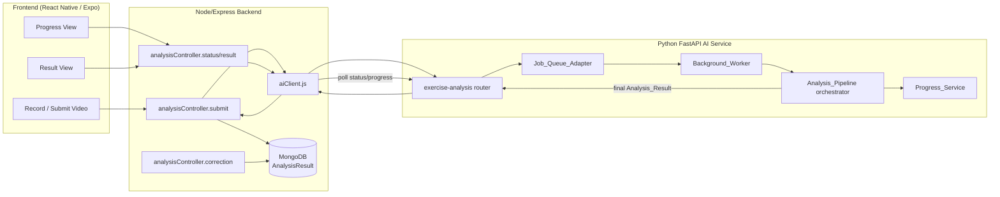
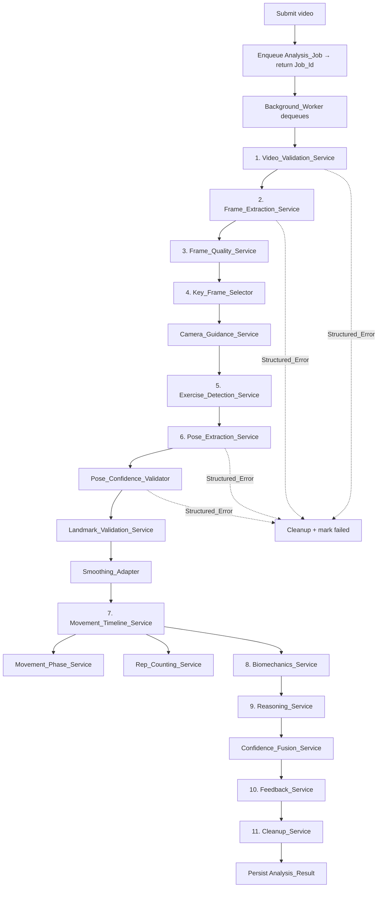
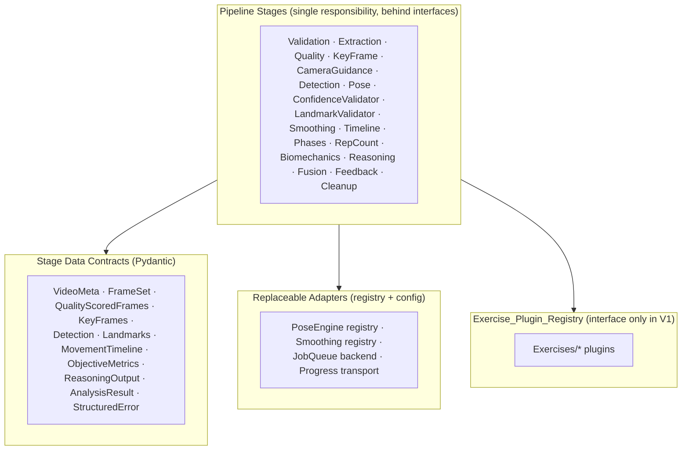
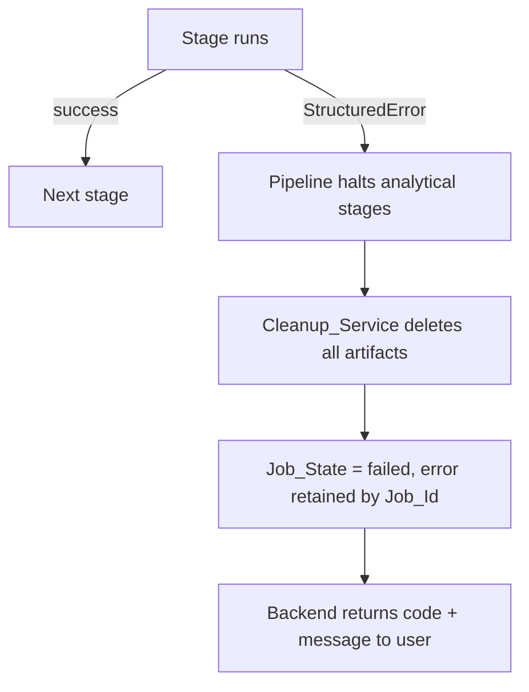
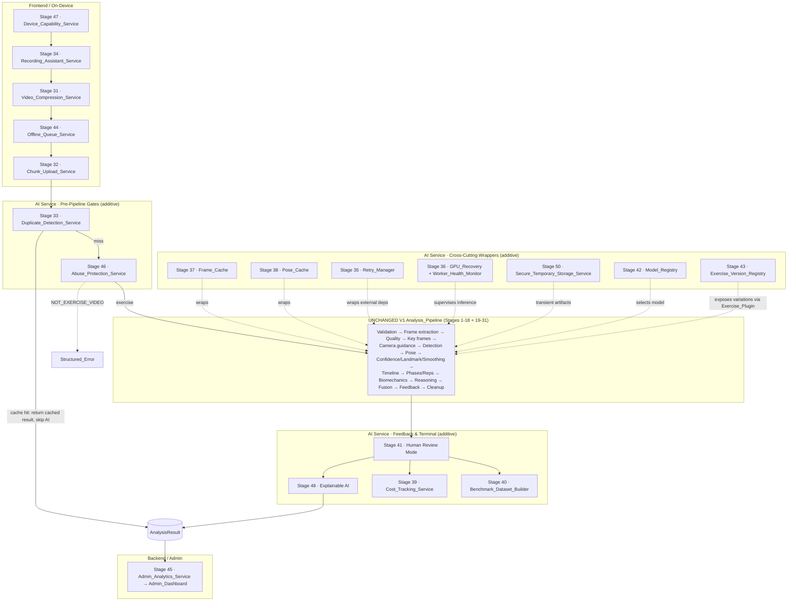
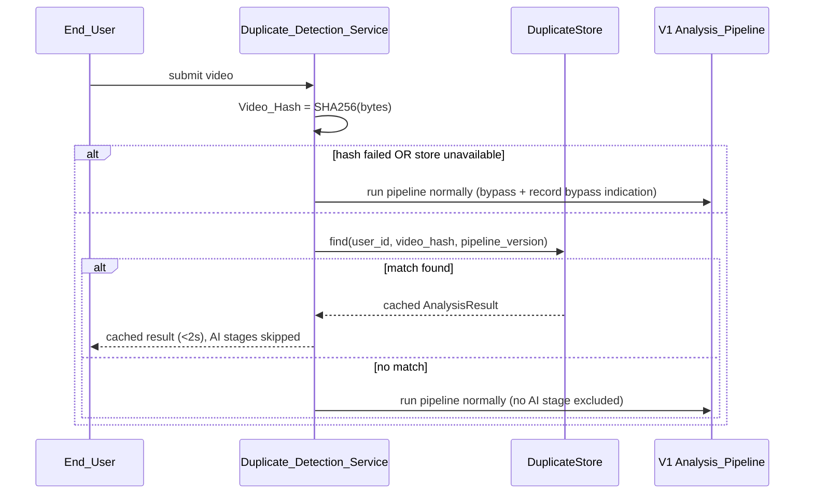
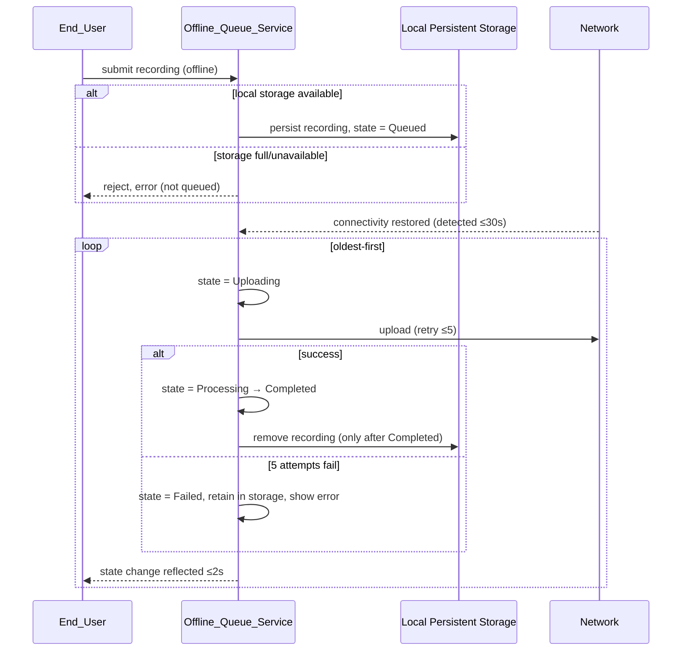
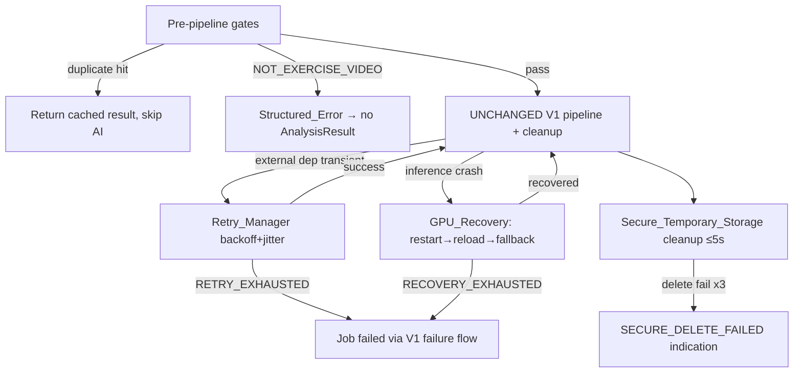

# Design Document

## Overview

This design specifies **Version 1 (Foundation)** of the AI-powered exercise form analysis feature for GetFit. The objective is a scalable, modular, privacy-preserving pipeline that ingests a user-recorded workout video and produces a structured analysis result, while persisting **only** the final result and never the video, frames, or pose images.

The design deliberately reuses the conventions already proven in the codebase:

- The **Vision Adapter** pattern in `ai-service/app/vision/` (a single interface, a backend registry, configuration-driven primary/fallback selection) is the template for every replaceable component in this feature — the `Pose_Extraction_Service`, the `Smoothing_Adapter`, the `Job_Queue_Adapter`, and the `Progress_Service` transport.
- The **async job model** already sketched in `ai-service/app/routers/video.py` (submit → `job_id` → poll `/result/{job_id}`) is formalized into a real `Job_Queue_Adapter` with a defined `Job_State` lifecycle.
- The **deterministic joint-angle math** in `ai-service/app/routers/pose.py` (`calc_angle`, COCO-17 keypoint indices) is the seed for the `Biomechanics_Service`.
- The **Node/Express integration** in `Backend/controllers/videoController.js` and `Backend/services/aiClient.js` (axios → AI service, Mongoose persistence with `userId` association) is extended additively for submission, polling, persistence, and corrections.

Version 1 explicitly delivers the *architecture* and the *data contracts*. It does **not** deliver validated exercise-quality scoring, coaching rules, or per-exercise logic. The `Feedback_Service` emits the full result structure, and the `Exercise_Plugin` interface and registry exist, but no per-exercise plugin logic is implemented.

### Design Goals

1. **Privacy by construction** — the original video and every intermediate artifact live only in a transient working location and are deleted on every termination path. Only the bounded `Analysis_Result` is persisted.
2. **Single-responsibility, replaceable stages** — each `Pipeline_Stage` sits behind an interface and is independently testable and swappable.
3. **Configuration-driven** — thresholds, sampling strategies, engine selection, and weights all come from configuration, never from hardcoded per-exercise logic.
4. **Additive integration** — Stages 19–30 (queue, progress, confidence validation, camera guidance, rep counting, phase detection, smoothing, landmark validation, fusion, plugins, versioning, analytics) layer on without changing the interfaces of Stages 1–18 or the existing backend APIs.

### Key Design Decisions

| Decision | Rationale |
|---|---|
| Pipeline lives in the Python AI service under a new `app/analysis/` package | Heavy CV/ML work (frame decoding, pose estimation, biomechanics) belongs with the existing vision stack; mirrors `app/vision/`. |
| Each stage is an ABC + concrete implementation registered in a registry | Directly mirrors the proven `VisionBackend`/`VisionAdapter` pattern, satisfying Req 14 (modularity) and Req 7/25/30 (replaceable engines). |
| Frame extraction runs inside the trusted pipeline boundary; only frames/landmarks reach a `Pose_Engine`, never the video | Satisfies Req 1.3 and Req 3.7 — the original video is never transmitted to any pose/vision/reasoning engine. |
| Stage I/O are explicit Pydantic data contracts | Enables isolated testing (Req 14.4), parallel execution in future (Req 16.1), and stable interfaces (Req 31.1). |
| `Job_Queue_Adapter`, `Progress_Service`, persistence stay behind interfaces | Backends (BullMQ/Redis/RabbitMQ/SQS; poll/push) are swappable by config (Req 19.7, Req 20.4). |
| MongoDB persistence remains in the Node backend | Reuses `videoController.js` conventions and `userId` association (Req 13.4); the AI service stays stateless except for transient work. |

## Architecture

### System Context



### Pipeline Stage Sequence

The `Analysis_Pipeline` orchestrator executes stages in the canonical order defined in Requirement 18.1, with Stages 19–30 woven in additively (camera guidance before pose extraction, confidence validation and smoothing and landmark validation between pose extraction and biomechanics, rep counting and phase detection over the timeline).



Every stage emits `Progress_Event`s to the `Progress_Service` at start/finish (Req 20.1). On any `Structured_Error`, the pipeline stops subsequent analytical stages, runs the `Cleanup_Service`, sets `Job_State = failed`, and returns the error (Req 18.3, Req 19.6).

### Layering



### Privacy Architecture

- The video is written to a per-job transient working directory (e.g., `tmp/{job_id}/`) or held in memory; its path set is tracked by the `Cleanup_Service`.
- `Frame_Extraction_Service` decodes frames inside this boundary. Only frames (and later derived landmarks) cross into `Pose_Engine` / vision calls; the video bytes never do (Req 1.3, 3.7).
- `Reasoning_Service` receives only `Objective_Metrics` and `Movement_Timeline` (Req 1.4, 10.2, 10.3).
- `Cleanup_Service` runs on success and failure via a `finally`-style guarantee (Req 12.3) and reports deleted locations (Req 12.4).
- The persisted record, every `Progress_Event`, and every analytics metric exclude raw video, frames, and pose images (Req 13.2, 20.6, 29.3, 30.2).

## Components and Interfaces

All Python interfaces follow the existing `VisionBackend` ABC convention: abstract base, concrete implementations, a registry/adapter for selection, and never raising on domain errors (return a `Structured_Error` instead).

### Stage Interface Convention

```python
# app/analysis/base.py
from abc import ABC, abstractmethod
from typing import Generic, TypeVar
from pydantic import BaseModel

class StructuredError(BaseModel):
    code: str                 # stable error code (see Error Handling)
    message: str              # human-readable, no stack details
    stage: str                # originating Pipeline_Stage name

TIn = TypeVar("TIn", bound=BaseModel)
TOut = TypeVar("TOut", bound=BaseModel)

class StageResult(BaseModel, Generic[TOut]):
    success: bool
    output: TOut | None = None
    error: StructuredError | None = None

class PipelineStage(ABC, Generic[TIn, TOut]):
    name: str = "stage"
    @abstractmethod
    async def run(self, data: TIn) -> "StageResult[TOut]":
        """Single responsibility. Never raises on domain failure;
        returns StageResult(success=False, error=StructuredError(...))."""
```

### Stage-by-Stage Responsibilities

| Stage | Interface (input → output) | Key behavior | Requirements |
|---|---|---|---|
| `Video_Validation_Service` | `VideoRef → VideoMeta` | Validate format/codec/duration/resolution/fps/size/orientation; aggregate all errors | 2.1–2.11, 15.1 |
| `Frame_Extraction_Service` | `VideoMeta → FrameSet` | Local decode; sampling strategy (every / every-N / every-X-ms / adaptive); timestamp each frame | 3.1–3.7 |
| `Frame_Quality_Service` | `FrameSet → QualityScoredFrames` | Per-frame blur/brightness/contrast/motion-blur/shake/visibility/occlusion; discard below thresholds | 4.1–4.5, 15.3, 15.4 |
| `Key_Frame_Selector` | `QualityScoredFrames → KeyFrames` | Subset ≤ max; drop near-duplicates; prefer transitions; preserve chronological order | 5.1–5.4 |
| `Camera_Guidance_Service` | `FrameSet → CameraGuidance` | Detect recording issues before pose; actionable recommendation per issue | 22.1–22.6 |
| `Exercise_Detection_Service` | `KeyFrames → Detection` | Exercise id + confidence + ranked alternatives; threshold gate | 6.1–6.4 |
| `Pose_Extraction_Service` | `KeyFrames → Landmarks` | Replaceable `Pose_Engine` via registry; normalized coords; per-landmark `Pose_Confidence`; multi-person error | 7.1–7.6, 21.1 |
| `Pose_Confidence_Validator` | `Landmarks → Landmarks` | Reject low-confidence landmarks; gate overall confidence before biomechanics | 21.1–21.5 |
| `Landmark_Validation_Service` | `Landmarks → Landmarks` | Reject anatomically impossible / implausible-jump poses | 26.1–26.5 |
| `Smoothing_Adapter` | `Landmarks → Landmarks` | Replaceable filter (One Euro / Kalman / Savitzky-Golay / Moving Average) by config | 25.1–25.5 |
| `Movement_Timeline_Service` | `Landmarks → MovementTimeline` | Ordered-by-timestamp entries with positions/angles/velocity/accel/direction | 8.1–8.4 |
| `Movement_Phase_Service` | `MovementTimeline → MovementPhases` | Generic phases {Start, Eccentric, Bottom, Concentric, Top} with start/end timestamps | 24.1–24.4 |
| `Rep_Counting_Service` | `MovementTimeline → RepetitionSummary` | Generic movement-cycle rep detection; count/phase timestamps/avg duration/consistency | 23.1–23.4 |
| `Biomechanics_Service` | `MovementTimeline → ObjectiveMetrics` | Deterministic math only; angles/bar path/depth/ROM/tempo/symmetry/CoM/balance | 9.1–9.4 |
| `Reasoning_Service` | `(MovementTimeline, ObjectiveMetrics) → ReasoningOutput` | LLM over structured data only; low-confidence marking | 10.1–10.4 |
| `Confidence_Fusion_Service` | `ConfidenceSources → OverallConfidence` | Bounded weighted fusion into [0,1]; no single source dominates | 27.1–27.4 |
| `Feedback_Service` | `(ReasoningOutput, ObjectiveMetrics, MovementTimeline) → AnalysisResult` | Full result structure; low-confidence statement | 11.1–11.4, 17.1 |
| `Cleanup_Service` | `ArtifactSet → CleanupReport` | Delete every artifact on all paths; report deleted locations | 12.1–12.4 |

### Replaceable Adapters

```python
# Pose_Extraction_Service mirrors VisionAdapter
class PoseEngine(ABC):
    name: str = "base"
    @abstractmethod
    async def is_available(self) -> bool: ...
    @abstractmethod
    async def extract(self, frames: list[Frame]) -> "PoseEngineResult": ...

class PoseExtractionService:
    def __init__(self):
        self._registry = self._build_registry()   # mediapipe, movenet, blazepose, openpose
        self.active = settings.POSE_ENGINE         # config-driven selection
```

```python
# Smoothing_Adapter
class SmoothingAlgorithm(ABC):
    name: str
    @abstractmethod
    def smooth(self, landmarks: list[FrameLandmarks]) -> list[FrameLandmarks]: ...
# registry: one_euro | kalman | savitzky_golay | moving_average ; selected by settings.SMOOTHING_ALGORITHM
```

```python
# Job_Queue_Adapter — single interface, swappable backend
class JobQueueAdapter(ABC):
    @abstractmethod
    async def enqueue(self, job: AnalysisJob) -> str: ...            # returns Job_Id
    @abstractmethod
    async def get(self, job_id: str) -> AnalysisJob | None: ...
    @abstractmethod
    async def set_state(self, job_id: str, state: JobState) -> None: ...
    @abstractmethod
    async def set_result(self, job_id: str, result: AnalysisResult) -> None: ...
    @abstractmethod
    async def set_error(self, job_id: str, error: StructuredError) -> None: ...
# backends: bullmq | redis | rabbitmq | sqs ; selected by settings.QUEUE_BACKEND
```

```python
# Progress_Service — transport-agnostic (poll/push), excludes analytical logic
class ProgressTransport(ABC):
    @abstractmethod
    async def publish(self, job_id: str, event: ProgressEvent) -> None: ...
    @abstractmethod
    async def latest(self, job_id: str) -> ProgressEvent | None: ...
# transports: poll | push | both ; selected by settings.PROGRESS_TRANSPORT
```

### Exercise Plugin Architecture (interface only in V1)

```python
class ExercisePlugin(ABC):
    exercise_id: str
    @abstractmethod
    def rom_definitions(self) -> dict: ...          # range-of-motion
    @abstractmethod
    def movement_phases(self) -> list[str]: ...
    @abstractmethod
    def joint_importance(self) -> dict: ...
    @abstractmethod
    def biomechanics_thresholds(self) -> dict: ...
    @abstractmethod
    def coaching_rules(self) -> list: ...            # empty in V1
    @abstractmethod
    def safety_checks(self) -> list: ...             # empty in V1

class ExercisePluginRegistry:
    """Discovers plugins under an `Exercises/` namespace keyed by exercise id.
    V1 defines only the interface and registry — no per-exercise logic."""
    def register(self, plugin: ExercisePlugin) -> None: ...
    def get(self, exercise_id: str) -> ExercisePlugin | None: ...
    def available(self) -> list[str]: ...
```

### Backend Integration (Node/Express)

Extends existing conventions in `videoController.js`/`aiClient.js` additively (no change to existing AI APIs):

- `POST /api/ai/analysis/submit` → `aiClient.submitAnalysis(videoUrl, exerciseHint)` → AI `POST /exercise-analysis/submit` → returns `{ jobId }` immediately (Req 19.1).
- `GET /api/ai/analysis/status/:jobId` → AI `GET /exercise-analysis/status/{job_id}` → `{ jobState, progress }` (Req 19.8, 20.4).
- `GET /api/ai/analysis/result/:jobId` → returns persisted `AnalysisResult` (with `userId` association) once `completed`.
- `POST /api/ai/analysis/:id/correction` → stores `user correction` on the `AnalysisResult` (Req 13.3).

New `aiClient.js` methods (`submitAnalysis`, `getAnalysisStatus`, `getAnalysisResult`) follow the existing axios pattern.

### Frontend

Presents the `Analysis_Result` fields from Requirement 11, subscribes to/polls `Progress_Service` for the human-readable status labels (Req 20.3), and submits corrections.

## Data Models

### Stage Contracts (AI service, Pydantic)

```python
class VideoMeta(BaseModel):
    container_format: str
    codec: str
    duration_sec: float
    width: int
    height: int
    fps: float
    size_bytes: int
    orientation: str            # "portrait" | "landscape"

class Frame(BaseModel):
    index: int
    timestamp_ms: float         # relative to start of video (Req 3.6)
    # pixel data referenced by transient path/handle, never persisted

class FrameSet(BaseModel):
    frames: list[Frame]
    source_meta: VideoMeta

class FrameQuality(BaseModel):
    blur: float
    brightness: float
    contrast: float
    motion_blur: float
    camera_shake: float
    body_visibility: float
    occlusion: float

class QualityScoredFrame(BaseModel):
    frame: Frame
    quality: FrameQuality
    retained: bool

class Landmark(BaseModel):
    x: float                    # normalized [0,1], resolution-independent (Req 7.4)
    y: float
    z: float = 0.0
    confidence: float           # Pose_Confidence in [0,1] (Req 21.1)

class FrameLandmarks(BaseModel):
    timestamp_ms: float
    landmarks: list[Landmark]   # fixed joint order (COCO-17 convention from pose.py)
    overall_confidence: float

class TimelineEntry(BaseModel):
    timestamp_ms: float
    joint_positions: dict[str, list[float]]
    joint_angles: dict[str, float]
    joint_velocity: dict[str, float]
    joint_acceleration: dict[str, float]
    movement_direction: dict[str, float]

class MovementTimeline(BaseModel):
    entries: list[TimelineEntry]     # ordered by timestamp_ms (Req 8.1)

class MovementPhase(BaseModel):
    phase: str                       # Start|Eccentric|Bottom|Concentric|Top
    start_ms: float
    end_ms: float

class RepetitionSummary(BaseModel):
    rep_count: int
    phase_timestamps: list[list[MovementPhase]]
    avg_rep_duration_ms: float
    movement_consistency: float      # [0,1]

class ObjectiveMetrics(BaseModel):
    joint_angles: dict[str, float]
    bar_path: list[list[float]]
    depth: float
    range_of_motion: dict[str, float]
    tempo: float
    symmetry: float
    center_of_mass: list[float]
    balance: float
    confidence: float

class Detection(BaseModel):
    exercise_id: str
    confidence: float
    alternatives: list[dict]         # [{exercise_id, confidence}], ranked desc

class ConfidenceSources(BaseModel):
    vision: float
    pose: float
    detection: float
    movement_quality: float
    biomechanics: float
    reasoning: float
```

### Job & Progress Models

```python
class JobState(str, Enum):
    queued = "queued"; validating = "validating"; extracting_frames = "extracting_frames"
    frame_quality = "frame_quality"; selecting_keyframes = "selecting_keyframes"
    detecting_exercise = "detecting_exercise"; extracting_pose = "extracting_pose"
    building_timeline = "building_timeline"; biomechanics = "biomechanics"
    reasoning = "reasoning"; generating_feedback = "generating_feedback"
    cleaning_up = "cleaning_up"; completed = "completed"; failed = "failed"

PROGRESS_LABELS = {                      # Req 20.3
    JobState.queued: "Uploading", JobState.validating: "Validating",
    JobState.extracting_frames: "Extracting Frames",
    JobState.selecting_keyframes: "Selecting Key Frames",
    JobState.detecting_exercise: "Detecting Exercise",
    JobState.extracting_pose: "Extracting Pose",
    JobState.building_timeline: "Building Timeline",
    JobState.biomechanics: "Computing Biomechanics",
    JobState.generating_feedback: "Generating Feedback",
    JobState.cleaning_up: "Cleaning Temporary Files",
    JobState.completed: "Complete",
}

class ProgressEvent(BaseModel):
    job_id: str
    state: JobState
    label: str
    percent: float | None = None        # excludes raw video/frames/pose (Req 20.6)

class AnalysisJob(BaseModel):
    job_id: str
    user_id: str
    state: JobState = JobState.queued
    result: "AnalysisResult | None" = None
    error: StructuredError | None = None
```

### Persisted Analysis Result (bounded — Req 13, Req 29)

Stored in MongoDB by the Node backend. **Excludes** original video, frames, pose images, and temporary files (Req 13.2, 29.3).

```python
class AnalysisResult(BaseModel):
    exercise_id: str                     # Req 13.1
    analysis_date: str                   # ISO timestamp
    overall_score: float
    # Scores (Req 11.1)
    movement_score: float
    range_of_motion: dict[str, float]
    tempo: float
    stability: float
    symmetry: float
    joint_alignment: dict[str, float]
    # Qualitative feedback (Req 11.2)
    strengths: list[str]
    mistakes: list[str]
    corrections: list[str]
    safety_warnings: list[str]
    improvement_tips: list[str]
    training_advice: list[str]
    # Movement metrics + reps
    movement_metrics: ObjectiveMetrics
    repetition_summary: RepetitionSummary
    overall_confidence: float
    low_confidence: bool                 # Req 11.4
    # User corrections (Req 13.3)
    user_corrections: list[dict] = []
    # Versioning metadata (Req 29.1)
    analysisVersion: str
    poseEngineVersion: str
    visionModelVersion: str
    reasoningModelVersion: str
    pipelineVersion: str
```

```javascript
// Backend Mongoose schema (extends videoController.js conventions)
const analysisResultSchema = new mongoose.Schema({
  userId: { type: ObjectId, ref: 'User', required: true, index: true }, // Req 13.4
  jobId: { type: String, index: true },
  exerciseId: String,
  overallScore: Number,
  scores: mongoose.Schema.Types.Mixed,        // movement/ROM/tempo/stability/symmetry/alignment
  feedback: mongoose.Schema.Types.Mixed,      // strengths/mistakes/corrections/...
  movementMetrics: mongoose.Schema.Types.Mixed,
  repetitionSummary: mongoose.Schema.Types.Mixed,
  overallConfidence: Number,
  lowConfidence: Boolean,
  userCorrections: [mongoose.Schema.Types.Mixed],
  versions: {                                  // Req 29
    analysisVersion: String, poseEngineVersion: String,
    visionModelVersion: String, reasoningModelVersion: String, pipelineVersion: String,
  },
  // NOTE: no videoUrl, no frames, no pose images — privacy boundary (Req 13.2)
}, { timestamps: true });
```

### Configuration (extends `app/core/config.py`)

```python
# Selection
POSE_ENGINE: str = "mediapipe"          # mediapipe|movenet|blazepose|openpose
SMOOTHING_ALGORITHM: str = "one_euro"   # one_euro|kalman|savitzky_golay|moving_average
QUEUE_BACKEND: str = "bullmq"           # bullmq|redis|rabbitmq|sqs
PROGRESS_TRANSPORT: str = "poll"        # poll|push|both
FRAME_SAMPLING: str = "every_n"         # every|every_n|every_ms|adaptive
# Thresholds (examples — all read from config, never hardcoded per-exercise)
SUPPORTED_FORMATS: list[str] = ["mp4", "mov"]
SUPPORTED_CODECS: list[str] = ["h264", "hevc"]
MIN_DURATION_SEC: float = 2.0; MAX_DURATION_SEC: float = 60.0
FRAME_SAMPLE_N: int = 5; FRAME_SAMPLE_MS: float = 200.0; MAX_KEYFRAMES: int = 30
QUALITY_THRESHOLDS: dict = {...}; MIN_BRIGHTNESS: float = 0.2; MAX_CAMERA_SHAKE: float = 0.5
DETECTION_CONFIDENCE_MIN: float = 0.5
POSE_LANDMARK_CONFIDENCE_MIN: float = 0.3; POSE_OVERALL_CONFIDENCE_MIN: float = 0.5
MAX_LANDMARK_JUMP: float = 0.25
FUSION_WEIGHTS: dict = {"vision":0.15,"pose":0.2,"detection":0.15,"movement_quality":0.15,"biomechanics":0.2,"reasoning":0.15}
FUSION_MAX_SINGLE_WEIGHT: float = 0.4   # no single source dominates (Req 27.3)
```

## Correctness Properties

*A property is a characteristic or behavior that should hold true across all valid executions of a system — essentially, a formal statement about what the system should do. Properties serve as the bridge between human-readable specifications and machine-verifiable correctness guarantees.*

The following properties were derived from the prework analysis. Redundant criteria were consolidated (privacy criteria, error-code mappings, ordering criteria, and job-lifecycle criteria were each merged into comprehensive properties).

### Property 1: Bounded persisted record excludes raw artifacts

*For any* `AnalysisResult`, the serialized persisted record's key set is a subset of the permitted field set (exercise id, analysis date, scores, feedback, movement metrics, repetition summary, confidence, user corrections, version metadata, and the submitting user id) and contains no original video, frame, pose-image, or temporary-file data.

**Validates: Requirements 1.2, 1.6, 13.1, 13.2, 13.4, 29.1, 29.3**

### Property 2: Downstream transmission excludes raw video and frames

*For any* invocation of the `Reasoning_Service`, any emitted `Progress_Event`, and any stored analytics metric, the payload contains only structured data (objective metrics, timeline, job/state metadata, aggregate counters) and excludes the original video, raw frames, and pose images.

**Validates: Requirements 1.3, 1.4, 3.7, 10.2, 10.3, 20.6, 30.2, 30.3, 31.4**

### Property 3: Cleanup removes every artifact on every termination path

*For any* set of temporary artifacts created during processing and *for any* termination path (success or failure at any stage), after the `Cleanup_Service` runs no artifact remains in the transient working location, and the cleanup report's deleted-location set equals the set of created artifacts.

**Validates: Requirements 1.1, 1.5, 12.1, 12.2, 12.3, 12.4**

### Property 4: Validation reports exactly the violated constraints

*For any* `VideoMeta`, the `Video_Validation_Service` returns success carrying the metadata if and only if every constraint (format, codec, duration bounds, resolution, frame rate, size) is satisfied; otherwise the set of returned error codes equals exactly the set of codes for the violated constraints, and orientation is recorded on success.

**Validates: Requirements 2.1, 2.2, 2.3, 2.4, 2.5, 2.6, 2.7, 2.8, 2.9, 2.10, 2.11**

### Property 5: Frame extraction count and timestamps match the sampling strategy

*For any* video of N frames and configured sampling strategy, the number of extracted frames equals the deterministic count implied by the strategy (every-frame → N; every-N → expected subsample count; every-X-ms → duration/X), and every extracted frame carries a non-negative timestamp relative to the start, with timestamps non-decreasing in extraction order.

**Validates: Requirements 3.1, 3.2, 3.3, 3.4, 3.6**

### Property 6: Quality scoring is complete and discards exactly sub-threshold frames

*For any* `FrameSet` and configured thresholds, every scored frame carries all quality fields (blur, brightness, contrast, motion blur, camera shake, body visibility, occlusion), and the retained set equals exactly those frames meeting all thresholds while discarded frames each fail at least one threshold.

**Validates: Requirements 4.1, 4.2, 4.3, 4.4, 16.3**

### Property 7: Key frame selection is bounded, de-duplicated, and chronological

*For any* set of retained quality-scored frames and configured maximum, the selected subset has cardinality at most the maximum, contains no near-duplicate pair under the similarity metric, and preserves strictly increasing chronological order.

**Validates: Requirements 5.1, 5.2, 5.4**

### Property 8: Exercise detection produces ranked, bounded confidences

*For any* set of key frames, the `Exercise_Detection_Service` returns an exercise identifier with a confidence in [0.0, 1.0] and a list of alternatives sorted in non-increasing confidence order, each alternative confidence in [0.0, 1.0].

**Validates: Requirements 6.1, 6.2**

### Property 9: Normalized landmarks are resolution-independent

*For any* frame, extracting landmarks from the frame at resolution R and from the same frame scaled to k·R produces equal normalized landmark coordinates within tolerance, and every returned landmark carries a `Pose_Confidence` in [0.0, 1.0].

**Validates: Requirements 7.4, 21.1**

### Property 10: Any registered pose engine and smoothing algorithm yields a downstream-valid landmark contract

*For any* pose engine in the registry and *for any* smoothing algorithm selected from configuration, the produced landmark output conforms to the `Landmarks` contract (correct shape, normalized range) and the smoothing output has the same structure and length as its input, so downstream stages consume it without modification.

**Validates: Requirements 7.3, 25.2, 25.3**

### Property 11: Movement timeline is ordered, complete, and derivative-consistent

*For any* set of frame landmarks, the constructed `MovementTimeline` is ordered non-decreasing by timestamp, every entry contains joint positions, joint angles, joint velocity, joint acceleration, and movement direction, and the computed velocity equals the finite difference of positions over the inter-frame interval within tolerance.

**Validates: Requirements 8.1, 8.2, 8.4**

### Property 12: Biomechanics computation is deterministic and complete

*For any* `MovementTimeline`, repeated executions of the `Biomechanics_Service` produce identical `ObjectiveMetrics`, and the metrics contain all of joint angles, bar path, depth, range of motion, tempo, symmetry, center of mass, and balance.

**Validates: Requirements 9.1, 9.3, 9.4**

### Property 13: Feedback result is structurally complete with confidence flagging

*For any* reasoning output, objective metrics, and timeline, the produced `Analysis_Result` contains all score fields (overall, movement, range of motion, tempo, stability, symmetry, joint alignment) and all qualitative fields (strengths, mistakes, corrections, safety warnings, improvement tips, training advice), and when any contributing confidence is below the configured threshold the result is marked low confidence.

**Validates: Requirements 10.4, 11.1, 11.2, 11.4, 17.1**

### Property 14: Repetition summary is timeline-derived and well-formed

*For any* `MovementTimeline`, the `Rep_Counting_Service` produces a `Repetition_Summary` whose count is a non-negative integer, average repetition duration is non-negative, and movement consistency lies in [0.0, 1.0]; the result is invariant to any supplied exercise hint (it depends only on the timeline).

**Validates: Requirements 23.1, 23.2, 23.3, 23.4**

### Property 15: Movement phases are generic, labeled, and time-bounded

*For any* `MovementTimeline`, every produced `Movement_Phase` carries a label drawn from {Start, Eccentric, Bottom, Concentric, Top} and has `start_ms` ≤ `end_ms`, with phases ordered and non-overlapping in time.

**Validates: Requirements 8.3, 24.1, 24.4**

### Property 16: Pose-confidence filtering retains exactly above-threshold landmarks

*For any* set of landmarks and configured per-landmark threshold, the retained landmarks are exactly those whose `Pose_Confidence` meets the threshold, and the set passed to the `Biomechanics_Service` is a subset of the retained landmarks.

**Validates: Requirements 21.2, 21.4**

### Property 17: Landmark validation rejects implausible poses and transitions

*For any* pose that violates a configured anatomical constraint (impossible bone length, crossed bones, impossible limb orientation) or whose inter-frame landmark displacement exceeds the configured maximum, the `Landmark_Validation_Service` returns a `Structured_Error` identifying the violated constraint or implausible transition; anatomically valid poses pass.

**Validates: Requirements 26.1, 26.2, 26.3**

### Property 18: Confidence fusion is bounded and no single source dominates

*For any* six per-stage confidence values in [0.0, 1.0] and configured bounded weights, the overall `Confidence_Score` lies in [0.0, 1.0], and varying any single source across its full range while holding the others fixed changes the overall score by at most that source's configured weight (no single source can move the overall across the full span).

**Validates: Requirements 27.1, 27.2, 27.3**

### Property 19: Condition-to-error-code mapping with well-formed structured errors

*For any* stage failure condition, the returned `Structured_Error` carries a non-empty stable code, a human-readable message, and the originating stage name, with no internal stack detail; and each defined condition maps to its specified code: all frames discarded with dominant absent visibility → `BODY_NOT_VISIBLE`; top detection confidence below threshold → `EXERCISE_NOT_RECOGNIZED`; more than one person → `MULTIPLE_PEOPLE`; retained-frame brightness below minimum → `CAMERA_TOO_DARK`; retained-frame shake above maximum → `CAMERA_SHAKING`; overall confidence below threshold → `LOW_CONFIDENCE`.

**Validates: Requirements 4.5, 6.3, 7.6, 15.1, 15.3, 15.4, 15.5, 15.6, 21.3, 26.4**

### Property 20: Camera guidance detects issues and is actionable or clears

*For any* frames exhibiting one or more of the recording conditions (body cut off, body too small, body too close, incorrect angle, poor lighting, excessive shake, landscape vs portrait, multiple people), the `Camera_Guidance_Service` flags each present condition and attaches a non-empty actionable recommendation to it; for frames with no issues it returns a result marked suitable with an empty issue list.

**Validates: Requirements 22.2, 22.3, 22.4**

### Property 21: Pipeline executes stages in canonical order, stopping on error

*For any* analysis run, the recorded sequence of executed stages is a prefix of the canonical order (validation, frame extraction, frame quality, key frame selection, camera guidance, exercise detection, pose extraction, confidence validation, landmark validation, smoothing, timeline, phases/reps, biomechanics, reasoning, fusion, feedback, cleanup); on a successful run the full sequence executes, and on a stage error no later analytical stage executes, the `Cleanup_Service` still runs, and the error is surfaced.

**Validates: Requirements 3.1, 8.3, 10.1, 18.1, 18.3, 19.2, 21.3, 22.1, 25.1, 25.4**

### Property 22: Job lifecycle — valid states, terminal outcomes, and query round-trip

*For any* analysis job, at every observation the `Job_State` is a member of the defined state set; submission returns a `Job_Id` with state `queued` before any stage runs; when a stage begins the state equals that stage's mapped value; a successful run terminates in `completed` with the result retrievable by `Job_Id`, and a failed run terminates in `failed` with the `Structured_Error` retrievable by `Job_Id`.

**Validates: Requirements 16.4, 18.2, 19.1, 19.3, 19.4, 19.5, 19.6, 19.8**

### Property 23: Queue adapter round-trip preserves job identity and state

*For any* registered queue backend and *for any* analysis job, enqueue followed by get returns a job with the same identity, and a state set through the adapter is reflected by a subsequent get — so any backend (BullMQ, Redis, RabbitMQ, SQS) is interchangeable behind the single interface.

**Validates: Requirements 19.7**

### Property 24: Progress label mapping and latest-event recency

*For any* `Job_State`, the progress label is a member of the allowed label set, with `completed` mapping to `Complete`; and *for any* sequence of published progress events for a job, querying progress returns the most recently published event for that job.

**Validates: Requirements 20.1, 20.3, 20.4, 20.5**

### Property 25: Exercise plugin registry round-trip

*For any* exercise plugin registered under an exercise identifier in the `Exercises/` namespace, `registry.get(id)` returns that plugin and `available()` lists the identifier, with no per-exercise logic required for the registry to function.

**Validates: Requirements 28.1, 28.2, 28.4, 28.5**

### Property 26: Synchronous and asynchronous orchestration are equivalent

*For any* input video processed through the pipeline, executing the pipeline synchronously and through the background worker (asynchronous) produces an equivalent `Analysis_Result`, preserving each stage's behavior.

**Validates: Requirements 31.3**

## Error Handling

### Structured Error Model

Every stage that cannot complete its responsibility returns a `Structured_Error` (never raises across stage boundaries), carrying a stable `code`, a human-readable `message`, and the originating `stage` (Req 15.1). The pipeline surfaces only `code` and `message` to the backend/user — never stack traces or internal detail (Req 15.6).

### Supported Error Codes (Req 15.2)

| Code | Raised by | Condition |
|---|---|---|
| `CORRUPTED_VIDEO` | Video_Validation_Service | Video cannot be decoded |
| `UNSUPPORTED_CODEC` | Video_Validation_Service | Codec not in configured list |
| `VIDEO_TOO_SHORT` | Video_Validation_Service | Duration < configured minimum |
| `VIDEO_TOO_LONG` | Video_Validation_Service | Duration > configured maximum |
| `EXERCISE_NOT_RECOGNIZED` | Exercise_Detection_Service | Top confidence < threshold |
| `MULTIPLE_PEOPLE` | Pose_Extraction_Service | More than one person detected |
| `BODY_NOT_VISIBLE` | Frame_Quality_Service | All frames discarded, dominant cause absent visibility |
| `CAMERA_TOO_DARK` | Frame_Quality_Service | Retained-frame brightness < minimum |
| `CAMERA_SHAKING` | Frame_Quality_Service | Retained-frame shake > maximum |
| `LOW_CONFIDENCE` | Pose_Confidence_Validator / Reasoning_Service | Overall confidence < threshold |

### Failure Flow



- On any stage error the pipeline stops subsequent analytical stages, always runs cleanup (guaranteed via `try/finally`), sets `Job_State = failed`, retains the error for retrieval by `Job_Id`, and returns the sanitized error (Req 18.3, 19.6, 12.2, 12.3).
- The `Confidence_Fusion_Service` and validators short-circuit before biomechanics when confidence gates fail (Req 21.3).
- The Node backend maps the AI service error payload to an HTTP response carrying only `code` and `message`, consistent with the existing `videoController.js` error pattern.

### Edge Cases

- **Adaptive sampling bounds**: adaptive frame extraction never exceeds the every-frame count and never falls below a configured minimum (handled by generator bounds in tests).
- **Empty/degenerate timeline**: a timeline with too few entries to compute derivatives yields zero/identity metrics rather than raising.
- **All landmarks rejected**: treated as overall low confidence → `LOW_CONFIDENCE` before biomechanics.
- **Special characters / encoding** in exercise hints and corrections are accepted and round-tripped without corruption.

## Testing Strategy

### Dual Approach

- **Property-based tests** verify the 26 universal properties above across generated inputs (deterministic biomechanics, validation, filtering, ordering, privacy, fusion, job lifecycle).
- **Unit tests** cover concrete examples, architectural conformance (interface implementation, isolated stage execution, config-driven selection), and specific error scenarios.
- **Integration tests** (1–3 examples each) cover external/infrastructure behavior: queue backend wiring, MongoDB persistence through the Node backend, the FastAPI router endpoints, and end-to-end submit→poll→result.

### Property-Based Testing

PBT is appropriate here because the pipeline is dominated by pure, deterministic transformations (biomechanics math, timeline construction, validation, filtering, confidence fusion) and structural invariants (privacy boundaries, ordering, job-state membership) that must hold across a large input space.

- **Python (ai-service)**: use **Hypothesis**. Generators for `VideoMeta`, `FrameSet`, `FrameLandmarks`, `MovementTimeline`, `ConfidenceSources`, and `JobState` sequences. Pose engines, queue backends, and LLM reasoning are **mocked/stubbed** so properties test our logic, not external services or model behavior.
- **Node (Backend)**: use **fast-check** for the persistence-boundary and correction round-trip properties (Properties 1 and the correction portion of Property 1 / Req 13.3), with the Mongoose layer mocked or run against an in-memory MongoDB.
- **Minimum 100 iterations** per property test.
- Each property test is tagged with a comment referencing its design property:
  - Tag format: `# Feature: ai-exercise-analysis, Property {number}: {property_text}`

Example tag:
```python
# Feature: ai-exercise-analysis, Property 12: For any MovementTimeline, repeated
# executions of the Biomechanics_Service produce identical ObjectiveMetrics ...
@given(timeline=movement_timelines())
@settings(max_examples=100)
def test_biomechanics_deterministic(timeline):
    assert biomechanics.run(timeline) == biomechanics.run(timeline)
```

### Property-to-Test Mapping

| Property | Layer | Library | Notes |
|---|---|---|---|
| 1, 13, 22 (result fields) | Python / Node | Hypothesis / fast-check | Persistence boundary + correction round-trip |
| 2, 3 (privacy/cleanup) | Python | Hypothesis | Spy on engine/reasoning/progress payloads; temp-dir assertions |
| 4, 5, 6, 7, 8 | Python | Hypothesis | Validation, extraction, quality, key frames, detection |
| 9, 10, 11, 12 | Python | Hypothesis | Pose normalization, adapter contracts, timeline, biomechanics |
| 14, 15, 16, 17, 18 | Python | Hypothesis | Reps, phases, confidence filtering, landmark validation, fusion |
| 19, 20 | Python | Hypothesis | Error-code mapping, camera guidance |
| 21, 26 | Python | Hypothesis | Pipeline ordering; sync/async equivalence (mocked stages) |
| 23, 24, 25 | Python | Hypothesis | Queue round-trip, progress recency/labels, plugin registry |

### Unit & Integration Tests (non-PBT)

- **Interface conformance** (Req 7.1, 14.1–14.4, 28): each stage implements `PipelineStage`; each adapter implements its ABC; stages run in isolation with contract I/O.
- **Config-driven selection** (Req 7.2, 21.5, 25.2, 26.5, 27.4): changing config selects the corresponding engine/algorithm/backend/threshold.
- **Architectural exclusions** (Req 9.2, 7.5, 17.2, 17.3, 24.2, 28.3, 31.6): spies assert no LLM calls in biomechanics/pose; no per-exercise logic modules in V1.
- **Backend contract preservation** (Req 31.1, 31.2): snapshot/contract tests confirm existing AI endpoints and backend APIs are unchanged.
- **Frontend** (Req 18.4): component test renders all Requirement 11 fields and progress labels.
- **Error-code support set** (Req 15.2): smoke test asserts the supported-code constant equals the required set.
- **End-to-end** (Req 18, 19, 20): one integration test submits a sample video, polls progress through states, and retrieves the persisted result.

---

# Version 2 (Production Extensions)

## V2 Overview

This section specifies **Version 2 (Production Extensions)** of the AI exercise form analysis feature. It is **strictly additive** to Version 1 (Foundation). Every Version 1 artifact above this line — the V1 Overview, Architecture, Stages 1–18 and the Stage 19–31 additions, the existing data contracts, the replaceable adapters, Correctness Properties 1–26, the V1 Error Handling, and the V1 Testing Strategy — remains **unchanged**. No existing API, data contract, or adapter is modified.

Version 2 hardens the pipeline for production by introducing twenty new components (product Stages 31–50, Requirements 32–51) plus a cross-cutting compatibility guarantee (Requirement 52). These cover on-device compression, resumable chunked upload, duplicate detection, pre-recording guidance, dependency retry, GPU failure recovery, frame/pose caching, cost tracking, benchmark dataset building, human review gating, model and exercise-version registries, offline queueing, admin analytics, abuse protection, device-capability adaptation, explainable scoring, multi-camera-ready interfaces, and secure temporary storage.

### V2 Design Principles (inherited from V1)

Every V2 component reuses the proven V1 conventions exactly:

1. **ABC + registry + config-driven selection** — the `VisionBackend`/`VisionAdapter` template from `ai-service/app/vision/` is the template for every new replaceable backend (`Model_Registry`, `Frame_Cache`, `Pose_Cache`, `Retry_Manager` policy, secure-storage backend).
2. **`PipelineStage` ABC** — every component that participates in the analysis flow (Duplicate detection, Abuse protection, Compression metadata stamping, secure-storage hooks) implements the existing `PipelineStage[TIn, TOut]` interface and returns `StageResult`/`StructuredError` rather than raising.
3. **Async job model** — the existing `Job_Queue_Adapter` / `Background_Worker` / `Progress_Service` model is reused; `GPU_Recovery_Service`, `Worker_Health_Monitor`, and the `Retry_Manager` wrap the existing worker and dependency calls without changing their interfaces.
4. **Privacy by construction (Req 1, preserved by Req 52.5)** — no V2 component persists video, frames, or pose images. Caches are volatile-only and cleared on completion; the `Secure_Temporary_Storage_Service` encrypts-at-rest and securely deletes; cost/benchmark/admin analytics store only hashes and aggregates.
5. **Additive-only (Req 52.1–52.4, 52.7)** — V2 lives entirely in new packages and new optional fields. Existing tests continue to pass because no existing signature or contract changes.

### V2 Scope Boundary

V2 delivers the *production-hardening infrastructure and interfaces*. As in V1, it does **not** introduce validated per-exercise coaching judgments. The `Exercise_Version_Registry` (Req 44) defines variation inheritance over the existing `Exercise_Plugin` interface (Req 28) but adds no per-exercise scoring logic. The `Multi_Camera_Interface` (Req 50) is declared only — invoking it returns a `Structured_Error`.

### V2 Requirement-to-Component Map

| Stage | Requirement | Component(s) | Location |
|---|---|---|---|
| 31 | 32 | `Video_Compression_Service` | Frontend (on-device) |
| 32 | 33 | `Chunk_Upload_Service` | Frontend + Backend receiver |
| 33 | 34 | `Duplicate_Detection_Service` | AI service (pre-pipeline) |
| 34 | 35 | `Recording_Assistant_Service` | Frontend (pre-recording) |
| 35 | 36 | `Retry_Manager` | AI service (dependency wrapper) |
| 36 | 37 | `GPU_Recovery_Service`, `Worker_Health_Monitor` | AI service (worker supervision) |
| 37 | 38 | `Frame_Cache` | AI service (around extraction) |
| 38 | 39 | `Pose_Cache` | AI service (around pose extraction) |
| 39 | 40 | `Cost_Tracking_Service` | AI service (analytics) |
| 40 | 41 | `Benchmark_Dataset_Builder` | AI service / Backend |
| 41 | 42 | Human Review Mode (extends `Feedback_Service`) | AI service (feedback) |
| 42 | 43 | `Model_Registry` | AI service |
| 43 | 44 | `Exercise_Version_Registry` | AI service |
| 44 | 45 | `Offline_Queue_Service` | Frontend |
| 45 | 46 | `Admin_Analytics_Service`, `Admin_Dashboard` | Backend + Frontend (admin) |
| 46 | 47 | `Abuse_Protection_Service` | AI service (pre-AI stage) |
| 47 | 48 | `Device_Capability_Service` | Frontend |
| 48 | 49 | Explainable AI (extends `Feedback_Service`) | AI service (feedback) |
| 49 | 50 | `Multi_Camera_Interface` | AI service (interface only) |
| 50 | 51 | `Secure_Temporary_Storage_Service` | AI service (transient storage) |
| — | 52 | Cross-cutting additive compatibility | All layers |

## V2 Architecture

### Where V2 Components Sit Relative to V1

V2 weaves additively around the unchanged V1 pipeline. On-device components run before upload; pre-pipeline gates (`Duplicate_Detection`, `Abuse_Protection`) run before any V1 AI stage; caches wrap extraction; `Retry_Manager` wraps external dependency calls; `GPU_Recovery` supervises inference workers; secure storage replaces the transient working-dir behavior additively; review/explainability/cost-tracking attach at feedback/terminal.



### Extended Pipeline Sequence (V2)

The V1 canonical order is **preserved unchanged**. V2 adds gates and wrappers around it:

```
[ON-DEVICE]  Device_Capability → Recording_Assistant → Compression → (Offline_Queue if offline) → Chunk_Upload
[PRE-PIPELINE] Duplicate_Detection ──hit──▶ return cached AnalysisResult (no AI stages)
                                   └─miss─▶ Abuse_Protection ──reject──▶ NOT_EXERCISE_VIDEO
                                                            └─pass──▶ V1 pipeline (UNCHANGED)
[AROUND V1]   Frame_Cache wraps Frame_Extraction · Pose_Cache wraps Pose_Extraction
              Retry_Manager wraps vision/pose/LLM/queue/database calls
              GPU_Recovery + Worker_Health_Monitor supervise Inference_Workers
              Secure_Temporary_Storage backs the transient working location
              Model_Registry supplies the active vision/pose/reasoning model
              Exercise_Version_Registry exposes variations through the Exercise_Plugin interface
[AT FEEDBACK] Feedback_Service additionally sets Review_Status and attaches Score_Explanations
[AT TERMINAL] Cost_Tracking records a Cost_Record · Benchmark_Dataset_Builder records on manual correction
[ADMIN]       Admin_Analytics aggregates operational metrics for the Admin_Dashboard
```

`Duplicate_Detection_Service` and `Abuse_Protection_Service` are independent `PipelineStage` instances inserted *before* the first V1 stage; they never alter a V1 stage's input/output contract (Req 34.5, 47.4). The caches and `Retry_Manager` are decorators around existing calls (Req 38.6, 39.4, 36.5). When any of these wrappers fail in a non-fatal way, they fall back to the exact V1 behavior (cache miss → decode/extract; retry exhaustion → structured error; duplicate-store unavailable → run normally).

### V2 Folder / Package Structure

All V2 code lives in **new** packages; no existing file is restructured.

```
ai-service/app/
  analysis/                      # V1 (unchanged)
  analysis_v2/                   # NEW — all server-side V2 components
    __init__.py
    gates/
      duplicate_detection.py     # Duplicate_Detection_Service (Req 34)
      abuse_protection.py        # Abuse_Protection_Service (Req 47)
    resilience/
      retry_manager.py           # Retry_Manager (Req 36)
      gpu_recovery.py            # GPU_Recovery_Service (Req 37)
      worker_health.py           # Worker_Health_Monitor (Req 37)
    caching/
      frame_cache.py             # Frame_Cache (Req 38)
      pose_cache.py              # Pose_Cache (Req 39)
      lru.py                     # shared volatile LRU primitive
    telemetry/
      cost_tracking.py           # Cost_Tracking_Service (Req 40)
      benchmark_builder.py       # Benchmark_Dataset_Builder (Req 41)
      admin_analytics.py         # Admin_Analytics_Service (Req 46)
    registries/
      model_registry.py          # Model_Registry (Req 43)
      exercise_version_registry.py  # Exercise_Version_Registry (Req 44)
    storage/
      secure_temp_storage.py     # Secure_Temporary_Storage_Service (Req 51)
    feedback_ext/
      review_mode.py             # Human Review Mode hook (Req 42)
      explainability.py          # Explainable AI hook (Req 49)
    multicamera/
      interface.py               # Multi_Camera_Interface (declaration only, Req 50)
    models_v2.py                 # V2 Pydantic data contracts (additive)
    config_v2.py                 # V2 configuration (extends core config additively)

Frontend/src/
  recording/
    deviceCapability.ts          # Device_Capability_Service (Req 48)
    recordingAssistant.ts        # Recording_Assistant_Service (Req 35)
    videoCompression.ts          # Video_Compression_Service (Req 32)
  upload/
    chunkUpload.ts               # Chunk_Upload_Service (Req 33)
    offlineQueue.ts              # Offline_Queue_Service (Req 45)

Backend/
  controllers/adminAnalyticsController.js   # Admin_Dashboard data + auth (Req 46)
  controllers/chunkUploadController.js       # chunk receiver/verify (Req 33)
  services/duplicateStore.js                 # prior-result lookup by user+hash+version (Req 34)
```

## V2 Components and Interfaces

All V2 Python interfaces follow the existing `VisionBackend`/`PipelineStage` ABC convention: an abstract base, concrete implementations, a registry/adapter for config-driven selection, and **never raising on domain failure** — components return a `StructuredError` (reusing the V1 model) instead. Pre-pipeline gates implement the existing `PipelineStage[TIn, TOut]` interface so the orchestrator treats them like any other stage.

### Stage 33 · Duplicate_Detection_Service (Req 34)

Runs before the first V1 stage. Computes a local SHA256 `Video_Hash`, looks up a prior result by `(user_id, video_hash, pipeline_version)`. On hit, returns the cached `AnalysisResult` and signals the orchestrator to skip every AI stage. On any failure (hash or store), it bypasses gracefully and lets the V1 pipeline run.

```python
# analysis_v2/gates/duplicate_detection.py
class DuplicateStore(ABC):
    """Replaceable lookup over prior results; backend selected by config."""
    @abstractmethod
    async def find(self, user_id: str, video_hash: str, pipeline_version: str) -> "AnalysisResult | None": ...

class DuplicateDetectionService(PipelineStage["VideoRef", "DuplicateDecision"]):
    name = "duplicate_detection"
    def __init__(self, store: DuplicateStore): self._store = store
    async def run(self, data: "VideoRef") -> "StageResult[DuplicateDecision]":
        # 1) compute SHA256 over full bytes (Req 34.1); on failure -> bypass (Req 34.6)
        # 2) lookup by user+hash+pipeline_version (Req 34.2); store down -> bypass (Req 34.7)
        # 3) hit -> DuplicateDecision(cache_hit=True, result=cached) within 2s, skip AI (Req 34.3)
        #    miss -> DuplicateDecision(cache_hit=False) -> pipeline runs normally (Req 34.4)
        ...
```

### Stage 46 · Abuse_Protection_Service (Req 47)

Runs after duplicate detection and **before any V1 AI stage**. Classifies whether the content is a genuine exercise recording; below threshold it stops the AI stages and returns `NOT_EXERCISE_VIDEO`.

```python
# analysis_v2/gates/abuse_protection.py
class AbuseProtectionService(PipelineStage["KeyFrames", "KeyFrames"]):
    name = "abuse_protection"
    async def run(self, data: "KeyFrames") -> "StageResult[KeyFrames]":
        # score in [0,1] (Req 47.1); < threshold -> StructuredError(NOT_EXERCISE_VIDEO) (Req 47.2)
        # >= threshold -> pass frames through unchanged (Req 47.3); cannot classify -> error (Req 47.6)
        # threshold from config (Req 47.5); contract identical to a passthrough stage (Req 47.4)
        ...
```

### Stage 35 · Retry_Manager (Req 36)

A decorator that wraps any external-dependency call (vision model, `Pose_Engine`, reasoning LLM, `Job_Queue_Adapter`, `Database`) with exponential backoff + jitter. Transient failures are retried up to the configured max; non-transient failures are not retried; exhaustion returns a `StructuredError` identifying the dependency. It never changes the wrapped call's signature (Req 36.5).

```python
# analysis_v2/resilience/retry_manager.py
class RetryPolicy(BaseModel):
    max_retries: int = 3            # 0..10 (Req 36.3)
    initial_delay_ms: int = 200
    multiplier: float = 2.0
    max_delay_ms: int = 10_000
    max_jitter_ms: int = 250

class TransientError(Exception): ...      # network timeout / connection / 503 / 429
class NonTransientError(Exception): ...

class RetryManager:
    def __init__(self, policy: RetryPolicy): self._policy = policy
    async def call(self, dependency: str, fn, *args, **kwargs):
        # retry on TransientError with backoff+jitter until success or max (Req 36.1, 36.7)
        # NonTransientError -> return originating error, no retry (Req 36.6)
        # exhaustion -> StructuredError(code=RETRY_EXHAUSTED, message=f"{dependency} retry exhausted") (Req 36.4)
        ...
```

### Stage 36 · GPU_Recovery_Service + Worker_Health_Monitor (Req 37)

Supervises `Inference_Worker`s: detects crashes, restarts (bounded), reloads the model, retries the job once per restart, falls back to a configured model, then marks the job failed on exhaustion. `Worker_Health_Monitor` polls health and excludes unhealthy workers from assignment.

```python
# analysis_v2/resilience/worker_health.py
class WorkerHealth(BaseModel):
    worker_id: str
    status: Literal["healthy", "unhealthy"]
    failure_count: int

class WorkerHealthMonitor:
    poll_interval_s: int = 15                 # <= 15s (Req 37.7)
    failure_limit: int = 5                    # per 5-min window (Req 37.5, 37.8)
    def record_failure(self, worker_id: str) -> None: ...
    def health(self, worker_id: str) -> WorkerHealth: ...     # (Req 37.7)
    def is_assignable(self, worker_id: str) -> bool: ...      # excludes unhealthy (Req 37.6)

# analysis_v2/resilience/gpu_recovery.py
class GPURecoveryService:
    max_restart_attempts: int = 3             # default (Req 37.1, 37.8)
    def __init__(self, monitor: WorkerHealthMonitor, registry: "ModelRegistry"): ...
    async def on_crash(self, worker_id: str, job: "AnalysisJob") -> "RecoveryOutcome":
        # detect<=10s, restart<=30s, reload model<=60s, retry job once/restart (Req 37.1, 37.2)
        # active model fails -> fallback model, retry (Req 37.3)
        # fallback fails -> mark job failed, no partial results, recovery-exhaustion error (Req 37.4)
        ...
```

### Stage 37 · Frame_Cache & Stage 38 · Pose_Cache (Req 38, 39)

Both reuse a shared **volatile** LRU primitive. `Frame_Cache` is keyed by `(Video_Hash, frame_timestamp)`; `Pose_Cache` by `(Frame_Hash, pose_engine_version)`. Both are memory-only, never persisted, cleared after processing, and fail open (cache error → recompute) — preserving the V1 privacy guarantee.

```python
# analysis_v2/caching/lru.py
class VolatileLRU(Generic[K, V]):
    def __init__(self, max_entries: int): ...
    def get(self, key: K) -> "V | None": ...
    def put(self, key: K, value: V) -> None: ...   # evicts LRU at capacity
    def clear(self) -> None: ...                    # called on processing completion

# analysis_v2/caching/frame_cache.py
class FrameCache:
    def __init__(self, max_frames: int): self._lru = VolatileLRU(max_frames)
    def get_or_decode(self, video_hash: str, ts_ms: float, decode):
        # exact-key hit -> cached frame, no decode (Req 38.2); miss -> decode + store (Req 38.1, 38.3)
        # LRU evict at capacity (Req 38.5); op failure -> decode anyway (Req 38.6); volatile only (Req 38.4)
        ...

# analysis_v2/caching/pose_cache.py
class PoseCache:
    def get_or_extract(self, frame_hash: str, engine_version: str, extract):
        # exact-key hit -> identical landmarks, no Pose_Engine call (Req 39.2)
        # miss -> extract + store (Req 39.3); LRU evict (Req 39.5); failure -> extract (Req 39.4); volatile (Req 39.6)
        ...
```

### Stage 39 · Cost_Tracking_Service (Req 40)

At any terminal job state, records exactly one anonymous `Cost_Record` within 5s. Cost data is analytics-only: excluded from the client `AnalysisResult` and from privacy artifacts; failure is non-blocking.

```python
# analysis_v2/telemetry/cost_tracking.py
class CostTrackingService:
    async def record(self, job: "AnalysisJob", metrics: "CostRecord") -> "None | FailureIndication":
        # one record per terminal state within 5s (Req 40.1); anonymous, unlinked (Req 40.2)
        # excluded from client result (Req 40.3) and from video/frames/pose (Req 40.4)
        # failure -> return result unmodified + failure indication (Req 40.5)
        ...
```

### Stage 40 · Benchmark_Dataset_Builder (Req 41)

On a manual correction, records one fully-populated `Benchmark_Sample` (rejecting incomplete samples). Exports all collected samples as a dataset (empty dataset when none). Never stores original video.

```python
# analysis_v2/telemetry/benchmark_builder.py
class BenchmarkDatasetBuilder:
    def record(self, sample: "BenchmarkSample") -> "StageResult[BenchmarkSample]":
        # all fields present+non-empty else reject, retain correction (Req 41.1, 41.2, 41.3)
        ...
    def export(self) -> "BenchmarkDataset":
        # all samples as one dataset; empty + indication when none (Req 41.4, 41.5); no video (Req 41.6)
        ...
```

### Stage 42 · Model_Registry (Req 43)

Registers interchangeable vision/pose/reasoning models behind a common interface. Registers at least MediaPipe, MoveNet, RTMPose, YOLO Pose, OpenPose. Rejects models not implementing the interface and config that names an unregistered model. Mirrors the V1 `PoseEngine` registry exactly.

```python
# analysis_v2/registries/model_registry.py
class RegisteredModel(ABC):                # common model interface (Req 43.2)
    name: str
    kind: Literal["vision", "pose", "reasoning"]
    @abstractmethod
    async def is_available(self) -> bool: ...
    @abstractmethod
    async def infer(self, request: "ModelRequest") -> "ModelResponse": ...

class ModelRegistry:
    REQUIRED = ["mediapipe", "movenet", "rtmpose", "yolo_pose", "openpose"]  # (Req 43.1)
    def register(self, model: RegisteredModel) -> "StructuredError | None":
        # reject if interface not satisfied (Req 43.3)
        ...
    def select(self, name: str) -> "StructuredError | None":
        # name absent -> reject, keep previous active model unchanged (Req 43.5)
        ...
    def active(self) -> RegisteredModel: ...   # selected by config (Req 43.4); swap w/o stage change (Req 43.6)
```

### Stage 43 · Exercise_Version_Registry (Req 44)

Registers named `Exercise_Variation`s of a base exercise with property inheritance, and exposes them through the **existing** `ExercisePlugin` interface from Req 28 — no change to that interface. Rejects variations whose base is missing and duplicate identifiers.

```python
# analysis_v2/registries/exercise_version_registry.py
class ExerciseVariation(BaseModel):
    variation_id: str
    base_exercise_id: str
    properties: dict                          # only overridden properties present

class ExerciseVersionRegistry:
    def register(self, variation: ExerciseVariation, replace: bool = False) -> "StructuredError | None":
        # base not registered -> reject, state unchanged, error names missing base (Req 44.5)
        # duplicate id and not replace -> reject, keep existing, duplicate-id error (Req 44.6)
        ...
    def resolve(self, variation_id: str, prop: str):
        # variation overrides win; otherwise inherit from base (Req 44.2)
        ...
    def as_plugin(self, variation_id: str) -> "ExercisePlugin":
        # expose through existing Req 28 ExercisePlugin interface (Req 44.3); add w/o stage change (Req 44.4)
        ...
```

### Stage 50 · Secure_Temporary_Storage_Service (Req 51)

Backs the V1 transient working location additively: encrypts artifacts at rest, auto-deletes within 5s of job termination, securely (unrecoverably) deletes, retries deletion, and reports deleted locations. It cooperates with — does not replace — the V1 `Cleanup_Service` contract.

```python
# analysis_v2/storage/secure_temp_storage.py
class SecureTemporaryStorageService:
    def write(self, artifact_id: str, data: bytes) -> str:
        # encrypt-at-rest before readable (Req 51.1); never persistent (Req 51.4)
        ...
    async def cleanup(self, job_id: str) -> "CleanupReport | StructuredError":
        # delete all created artifacts within 5s of termination (Req 51.2)
        # secure (unrecoverable) deletion (Req 51.3); retry up to 3x, error names undeleted location (Req 51.5)
        # report deleted locations (Req 51.6)
        ...
```

### Stage 41 · Human Review Mode & Stage 48 · Explainable AI (Req 42, 49) — Feedback_Service extensions

These are **additive hooks** invoked by the existing `Feedback_Service` after it builds the V1 result. They set `review_status` and attach `score_explanations`. The `Feedback_Service` interface signature is unchanged; the new fields are optional/additive on `AnalysisResult`.

```python
# analysis_v2/feedback_ext/review_mode.py
def assign_review_status(overall_confidence: float, threshold: float | None) -> "ReviewStatus":
    # threshold absent or out of [0,1] -> Needs Review + invalid-config indication (Req 42.6)
    # confidence < threshold -> Needs Review (Req 42.1); >= -> Confident (Req 42.2)
    # exactly one status; never represent Needs Review as Confident (Req 42.4, 42.5)
    ...

# analysis_v2/feedback_ext/explainability.py
def explain_score(factors: dict[str, float]) -> "ScoreExplanation | None":
    # weights for ROM, tempo, balance, stability, symmetry, each 0..100, summing to 100 (Req 49.2)
    # any required factor missing -> return None so caller omits the score (Req 49.3, 49.4)
    ...
```

### Frontend Components (Req 32, 33, 35, 45, 48)

```typescript
// recording/deviceCapability.ts — Device_Capability_Service (Req 48)
type Tier = "high-end" | "mid-range" | "low-end";
interface DeviceCapabilityProfile { tier: Tier; resolution: number; frameSamplingRate: number;
  uploadQuality: number; compressionTarget: number; detectionCompleted: boolean; }
function detectCapability(): Promise<DeviceCapabilityProfile>;  // <=2s, same tier => same settings;
                                                                // timeout/fail => low-end safe default (Req 48.1-48.5)

// recording/recordingAssistant.ts — Recording_Assistant_Service (Req 35)
interface RecordingGuidance { ready: boolean;
  instructions: { condition: string; adjustment: string; severity: number }[]; } // one per condition, severity-ordered
function analyzePreview(frame: PreviewFrame): RecordingGuidance | StructuredError; // fail => non-blocking error (Req 35.6)

// recording/videoCompression.ts — Video_Compression_Service (Req 32)
interface CompressionMetadata { originalSize: number; compressedSize: number;
  compressionRatio: number; compressionTime: number; }
function compress(video: LocalVideo): Promise<{ output: LocalVideo; meta: CompressionMetadata } | StructuredError>;
// 1080p->720p/30fps/H264, no upscale; target size 5-15MB; fail => COMPRESSION_FAILED + upload original (Req 32)

// upload/chunkUpload.ts — Chunk_Upload_Service (Req 33)
interface UploadChunk { index: number; sha256: string; verified: boolean; }
interface UploadSession { chunks: UploadChunk[]; progress: number; // verified/total
  pause(): void; resume(): void; cancel(): void; }                   // resume from first unverified

// upload/offlineQueue.ts — Offline_Queue_Service (Req 45)
type OfflineQueueState = "Queued" | "Uploading" | "Processing" | "Completed" | "Failed";
interface QueuedRecording { id: string; submittedAt: number; state: OfflineQueueState; }
// persist locally; auto-upload oldest-first on reconnect; retry<=5; never lose until Completed (Req 45)
```

### Backend Components (Req 33, 46)

```javascript
// controllers/chunkUploadController.js — receives + verifies chunks (Req 33)
//   verifies SHA256 per chunk; tracks verified set; supports resume/cancel; 24h session window.
// services/duplicateStore.js — prior-result lookup (Req 34)
//   findByUserHashVersion(userId, videoHash, pipelineVersion) over the existing AnalysisResult collection.
// controllers/adminAnalyticsController.js — Admin_Dashboard (Req 46)
//   requireAdmin middleware (reuses existing auth); returns aggregate-only metrics; 401/403 for non-admins.
```

The `Multi_Camera_Interface` (Req 50) is covered in **V2 Data Models** below (declaration only).

## V2 Data Models

All V2 data contracts are **new** Pydantic/TS types in `models_v2.py` / frontend modules. The only change to an existing contract is **additive optional fields** on `AnalysisResult` (`review_status`, `score_explanations`) — existing fields and their semantics are untouched (Req 52.3).

```python
# analysis_v2/models_v2.py

class CompressionMetadata(BaseModel):           # Req 32.7
    original_size: int
    compressed_size: int
    compression_ratio: float
    compression_time_ms: float

class UploadChunk(BaseModel):                   # Req 33.1-33.3
    index: int                                  # ordered
    size_bytes: int                             # 1MB..50MB, final may be smaller
    sha256: str                                 # per-chunk checksum
    verified: bool = False                      # verified iff recomputed == original

class CostRecord(BaseModel):                    # Req 40.1 — analytics only, never in client result
    processing_time_ms: float
    gpu_memory_mb: float
    vram_usage_mb: float
    frame_count: int
    model_used: str
    token_count: int
    estimated_inference_cost: float
    worker_id: str
    queue_wait_ms: float
    # NOTE: no user_id, no video/frames/pose (Req 40.2, 40.4)

class BenchmarkSample(BaseModel):               # Req 41.2 — all fields required & non-empty
    image_hash: str
    exercise: str
    prediction: str
    ground_truth: str
    confidence: float                           # 0.0..1.0
    reason: str
    manual_correction: str
    pipeline_version: str
    # NOTE: no original video (Req 41.6)

class ReviewStatus(str, Enum):                  # Req 42.5 — exactly one of two
    confident = "Confident"
    needs_review = "Needs Review"

class ScoreExplanation(BaseModel):              # Req 49.2 — weights sum to 100
    score_name: str
    factors: dict[str, float]                   # {range_of_motion, tempo, balance, stability, symmetry} each 0..100
    # invariant: sum(factors.values()) == 100

class DeviceCapabilityProfile(BaseModel):       # Req 48.1-48.5 (also produced on-device)
    tier: Literal["high-end", "mid-range", "low-end"]
    resolution: int
    frame_sampling_rate: int
    upload_quality: int
    compression_target: int
    detection_completed: bool = True

class OfflineQueueState(str, Enum):             # Req 45.3
    queued = "Queued"; uploading = "Uploading"; processing = "Processing"
    completed = "Completed"; failed = "Failed"

class CameraAngle(str, Enum):                   # Req 50.1
    front = "Front"; side = "Side"; rear = "Rear"

class MultiCameraInput(BaseModel):              # Req 50.1 — declaration only
    angles: dict[CameraAngle, "VideoRef"] = {}
    fusion_input: "VideoRef | None" = None

class MultiCameraInterface(ABC):                # Req 50.2, 50.3, 50.5 — declared, not implemented
    @abstractmethod
    async def fuse(self, inputs: MultiCameraInput) -> "StageResult":
        """Declaration only. Any invocation in V2 returns
        StructuredError(code='MULTI_CAMERA_NOT_IMPLEMENTED') without
        touching single-camera state (Req 50.5)."""
```

### Additive AnalysisResult Fields (privacy-preserving)

The V1 `AnalysisResult` is extended with two **optional, additive** fields. The persisted-record privacy boundary (V1 Property 1, Req 13.2/29.3) is preserved: these fields carry only derived scalars/structures, never video/frames/pose. Cost records, benchmark samples, and admin metrics are stored **separately** and are explicitly excluded from the client result (Req 40.3) and from privacy artifacts.

```python
class AnalysisResult(BaseModel):
    # ... ALL existing V1 fields unchanged ...
    # --- V2 additive fields (optional; absent => exact V1 shape) ---
    review_status: "ReviewStatus | None" = None          # Req 42
    score_explanations: list["ScoreExplanation"] = []    # Req 49 (only for scores that could be explained)
```

```javascript
// Backend Mongoose schema — additive optional fields only (Req 52.3)
//   reviewStatus: { type: String, enum: ['Confident', 'Needs Review'] },
//   scoreExplanations: [mongoose.Schema.Types.Mixed],
//   videoHash: { type: String, index: true },   // for duplicate lookup (Req 34.2) — hash only, never video
//   pipelineVersion: String                       // duplicate key component
// Cost_Record / Benchmark_Sample / admin metrics live in SEPARATE collections, never joined to the client result.
```

### V2 Configuration (extends config additively)

```python
# analysis_v2/config_v2.py — all additive; no existing key changed
# Compression (Req 32)
COMPRESSION_TARGET_RESOLUTION: int = 720
COMPRESSION_TARGET_FPS: int = 30
COMPRESSION_CODEC: str = "h264"
COMPRESSION_TARGET_BITRATE_KBPS: int = 2500
COMPRESSION_TARGET_QUALITY: float = 0.85
COMPRESSION_TARGET_SIZE_MB: float = 10.0          # must be within [5, 15]
COMPRESSION_MAX_TIME_MS: int = 30_000
# Chunk upload (Req 33)
CHUNK_SIZE_MB: float = 5.0                         # within [1, 50]
CHUNK_MAX_RETRIES: int = 3
UPLOAD_RESUME_WINDOW_HOURS: int = 24
# Duplicate detection (Req 34) / Abuse protection (Req 47)
DUPLICATE_LOOKUP_TIMEOUT_MS: int = 2_000
ABUSE_CONTENT_THRESHOLD: float = 0.6
# Recording assistant (Req 35)
RECORDING_REFRESH_INTERVAL_MS: int = 300
RECORDING_MAX_ANALYSIS_LATENCY_MS: int = 200
RECORDING_SEVERITY_ORDER: list[str] = [...]
# Retry manager (Req 36)
RETRY_MAX: int = 3                                 # 0..10
RETRY_INITIAL_DELAY_MS: int = 200
RETRY_MULTIPLIER: float = 2.0
RETRY_MAX_DELAY_MS: int = 10_000
RETRY_MAX_JITTER_MS: int = 250
# GPU recovery (Req 37)
GPU_MAX_RESTART_ATTEMPTS: int = 3
GPU_FAILURE_LIMIT: int = 5
GPU_FAILURE_WINDOW_MS: int = 300_000
GPU_FALLBACK_MODEL: str = "movenet"
WORKER_HEALTH_POLL_S: int = 15
# Caches (Req 38, 39)
FRAME_CACHE_MAX: int = 2_000
POSE_CACHE_MAX: int = 2_000
# Review (Req 42) / Models (Req 43)
REVIEW_THRESHOLD: float = 0.6                      # within [0,1] else => Needs Review
ACTIVE_VISION_MODEL: str = "mediapipe"
ACTIVE_POSE_MODEL: str = "mediapipe"
ACTIVE_REASONING_MODEL: str = "default"
# Offline queue (Req 45) / Admin (Req 46) / Secure storage (Req 51)
OFFLINE_MAX_UPLOAD_RETRIES: int = 5
OFFLINE_RECONNECT_DETECT_S: int = 30
ADMIN_METRIC_INTERVAL_S: int = 60
ADMIN_AGGREGATION_WINDOW_MIN: int = 5
SECURE_DELETE_MAX_RETRIES: int = 3
SECURE_DELETE_DEADLINE_S: int = 5
```

### Sequence Diagram — Compression + Chunked Upload + Resume (Req 32, 33)

```mermaid
sequenceDiagram
    participant U as End_User (device)
    participant CMP as Video_Compression_Service
    participant CU as Chunk_Upload_Service
    participant BE as Backend receiver
    U->>CMP: submit recorded video
    alt compression succeeds
        CMP->>CMP: 1080p→720p/30fps/H264, size ≤ target (5–15MB)
        CMP-->>CU: compressed video + Compression_Metadata
    else compression fails / times out
        CMP-->>CU: COMPRESSION_FAILED → upload ORIGINAL (fallback)
    end
    CU->>CU: split into ordered chunks, SHA256 each
    loop each chunk
        CU->>BE: upload chunk[i]
        BE->>BE: recompute SHA256; verified iff equal
        alt verified
            BE-->>CU: ack(verified) → progress = verified/total
        else fail
            CU->>BE: retry chunk[i] (≤3, no re-upload of verified)
        end
    end
    Note over CU,BE: interruption → resume from first unverified chunk (≤24h);<br/>after 24h → session expired, start anew
    CU-->>U: upload complete (all chunks verified)
```

### Sequence Diagram — Duplicate Detection (Req 34)



### Sequence Diagram — GPU Failure Recovery (Req 37)

```mermaid
sequenceDiagram
    participant W as Inference_Worker
    participant M as Worker_Health_Monitor
    participant G as GPU_Recovery_Service
    participant R as Model_Registry
    W--xG: crash during inference
    G->>G: detect ≤10s
    G->>W: restart ≤30s, reload active model ≤60s
    G->>W: retry job once
    alt active model recovers
        W-->>G: inference succeeds
    else active model fails
        G->>R: select fallback model
        G->>W: retry job with fallback
        alt fallback succeeds
            W-->>G: inference succeeds
        else fallback also fails
            G->>G: mark job failed, no partial results, recovery-exhaustion error
        end
    end
    M->>W: poll health ≤15s; >failure_limit in 5min → mark unhealthy → exclude from assignment
```

### Sequence Diagram — Offline Queue (Req 45)



## V2 Correctness Properties

*A property is a characteristic or behavior that should hold true across all valid executions of a system — essentially, a formal statement about what the system should do. Properties serve as the bridge between human-readable specifications and machine-verifiable correctness guarantees.*

These properties **continue the V1 numbering (Properties 1–26 above remain unchanged)** and cover the new deterministic, structural, and privacy behaviors introduced in Version 2. Redundant criteria identified in the prework reflection were consolidated (the two caches into one generic property; compression success-path criteria into one property; chunk integrity, progress, and completion criteria merged; gate, registry, lifecycle, and privacy criteria each merged into comprehensive properties). Pose engines, LLMs, GPU/worker processes, network, camera, and device storage are mocked so each property tests our logic.

### Property 27: Compression preserves resolution ceiling without upscaling

*For any* source video resolution, the `Video_Compression_Service` output resolution equals the source resolution when it is at or below 720p and equals 720p when the source is above 720p, and the output is never upscaled above the source.

**Validates: Requirements 32.2**

### Property 28: Successful compression is bounded, sufficient, and metadata-consistent

*For any* video that compresses successfully, the compressed size does not exceed the configured target output size, the measured quality metric is greater than or equal to the configured target quality, the produced `Compression_Metadata` has all of originalSize, compressedSize, compressionRatio, and compressionTime populated with compressionRatio equal to compressedSize over originalSize, the uploaded payload is the compressed video (the original is excluded), and no compressed video remains in persistent storage after upload.

**Validates: Requirements 32.1, 32.4, 32.5, 32.7, 32.8, 32.9**

### Property 29: Compression failure falls back to the unchanged original

*For any* compression that fails or exceeds the configured maximum compression time, the `Video_Compression_Service` returns a `Structured_Error` with code `COMPRESSION_FAILED`, the original video bytes remain unchanged, and the `Chunk_Upload_Service` uploads the original video as the fallback.

**Validates: Requirements 32.6**

### Property 30: Chunking is an order-preserving exact partition

*For any* file size and configured chunk size in the 1–50 MB range, the `Chunk_Upload_Service` produces ordered chunks whose concatenation reconstructs the original file exactly, where every chunk except possibly the last has the configured size and the last chunk size is in the range (0, configured size].

**Validates: Requirements 33.1**

### Property 31: Chunk verification is a sound integrity round-trip

*For any* chunk, its stored SHA256 equals the SHA256 of its bytes, and a chunk is marked verified if and only if its recomputed checksum equals the originally computed checksum; any single-byte mutation of a chunk causes verification to fail.

**Validates: Requirements 33.2, 33.3**

### Property 32: Bounded retry never re-sends verified chunks; exhaustion halts and reports

*For any* sequence of transient chunk failures, the `Chunk_Upload_Service` retries a failing chunk at most 3 times and never re-uploads a previously verified chunk; if a chunk's retry limit is exhausted, the upload halts, every previously verified chunk is retained, and the failed chunk is identified.

**Validates: Requirements 33.4, 33.5**

### Property 33: Resume starts at the first unverified chunk

*For any* partially completed upload within the 24-hour window, resuming continues from the chunk whose index is the minimum index among unverified chunks, leaving all verified chunks intact.

**Validates: Requirements 33.6**

### Property 34: Progress equals the verified fraction and completion is exact

*For any* upload, at every observation the reported progress equals the number of verified chunks divided by the total chunk count, lies in [0.0, 1.0], is non-decreasing across verifications, and the upload is reported complete if and only if every chunk is verified (progress equals 1.0).

**Validates: Requirements 33.9, 33.10**

### Property 35: Cancel discards all chunks and releases storage

*For any* sequence of pause and resume operations followed by a cancel, the `Chunk_Upload_Service` discards every uploaded chunk and releases the associated upload storage, leaving the verified set empty.

**Validates: Requirements 33.8**

### Property 36: Video hashing is deterministic and content-discriminating

*For any* two video byte sequences, the locally computed `Video_Hash` is identical when the byte content is identical and differs when the byte content differs.

**Validates: Requirements 34.1**

### Property 37: Duplicate decision returns cached result on exact-triple match and runs otherwise

*For any* submission, when a prior `Analysis_Result` exists whose End_User identifier, `Video_Hash`, and pipeline version all exactly equal those of the submission, the `Duplicate_Detection_Service` returns that cached result and no AI stage is invoked; when no such prior result exists, the pipeline runs normally with no AI stage excluded.

**Validates: Requirements 34.2, 34.3, 34.4**

### Property 38: Duplicate detection degrades gracefully

*For any* failure to compute the `Video_Hash` or any unavailability of the prior-result store, the `Duplicate_Detection_Service` allows the Analysis_Pipeline to execute normally and records an indication that the duplicate check was bypassed.

**Validates: Requirements 34.6, 34.7**

### Property 39: Recording guidance is a severity-ordered bijection over detected conditions

*For any* camera preview exhibiting a set of recording conditions, the `Recording_Assistant_Service` returns exactly one corrective instruction per detected condition (a bijection), each instruction naming the detected condition and the required adjustment, ordered by the configured severity ranking; when no conditions are present it returns guidance marked ready with an empty instruction list.

**Validates: Requirements 35.2, 35.3, 35.4**

### Property 40: Preview-analysis failure is non-blocking

*For any* unavailable or failing camera preview, the `Recording_Assistant_Service` returns a `Structured_Error` indicating guidance is unavailable while still allowing the End_User to begin recording (the result never blocks recording).

**Validates: Requirements 35.6**

### Property 41: Retry succeeds-or-bounds with disciplined backoff

*For any* sequence of transient failures followed by a success at attempt k, the `Retry_Manager` returns the successful result when k is within the configured maximum, performing exactly k attempts; each inter-attempt delay lies within the exponential-backoff-plus-jitter bound implied by the configured initial delay, multiplier, maximum delay, and maximum jitter.

**Validates: Requirements 36.1, 36.7**

### Property 42: Retry exhaustion and non-transient classification are correct and request-preserving

*For any* External_Dependency call, a non-transient failure causes exactly one attempt with the originating error returned (no retry), and exhausting the configured maximum on transient failures returns a `Structured_Error` identifying the failed dependency and indicating retry exhaustion; in all cases the request passed to the dependency is unchanged.

**Validates: Requirements 36.4, 36.6**

### Property 43: GPU recovery escalates within bounds then fails cleanly

*For any* inference crash scenario, the `GPU_Recovery_Service` restarts the worker at most the configured maximum attempts and retries the job once per restart; if the active model still fails it switches to the configured fallback model and retries; if the fallback also fails the affected job is marked failed with no partial results and a recovery-exhaustion error.

**Validates: Requirements 37.1, 37.2, 37.3, 37.4**

### Property 44: Worker health classification gates assignment

*For any* worker, its health status is exactly one of healthy or unhealthy with a non-negative recorded failure count, the worker is marked unhealthy when its failure count exceeds the configured limit within the window, and an unhealthy worker is never selected for Analysis_Job assignment.

**Validates: Requirements 37.5, 37.6, 37.7**

### Property 45: Caches return identical data on hit, recompute on miss, evict LRU, and stay volatile

*For any* cache (`Frame_Cache` or `Pose_Cache`) and *for any* sequence of accesses, an exact-key hit returns data identical to what was stored without invoking the underlying decode/extract, a miss invokes the underlying operation and stores the result, the number of stored entries never exceeds the configured maximum (the least-recently-used entry is evicted first), a store or retrieve failure falls back to recompute without interrupting the pipeline, and after processing completes the cache holds no entries (volatile only, never persisted).

**Validates: Requirements 38.1, 38.2, 38.3, 38.4, 38.5, 38.6, 39.1, 39.2, 39.3, 39.4, 39.5, 39.6**

### Property 46: Cost tracking records exactly one complete record and never blocks

*For any* Analysis_Job reaching a terminal state, the `Cost_Tracking_Service` records exactly one `Cost_Record` with all fields (processing time, GPU memory, VRAM usage, frame count, model used, token count, estimated inference cost, worker identifier, queue wait time) populated; if recording fails, the `Analysis_Result` is returned to the client unmodified together with a failure indication identifying the affected job.

**Validates: Requirements 40.1, 40.5**

### Property 47: Benchmark samples are all-or-nothing and exports are faithful

*For any* attempted `Benchmark_Sample` recording, the sample is accepted if and only if every required field (image hash, exercise, prediction, ground truth, confidence in [0.0, 1.0], reason, manual correction, pipeline version) is present and non-empty; an incomplete sample is rejected with the manual correction retained unchanged and an incomplete-data indication; and an export returns exactly the set of currently collected samples (an empty dataset with a no-samples indication when none exist), excluding the original video.

**Validates: Requirements 41.1, 41.2, 41.3, 41.4, 41.5, 41.6**

### Property 48: Review status is a total, fail-safe threshold mapping

*For any* overall Confidence_Score in [0.0, 1.0] and configured review threshold, the `Feedback_Service` assigns exactly one `Review_Status`, equal to Needs Review when the confidence is strictly below the threshold and Confident otherwise, never representing a Needs Review result as Confident; and when the threshold is absent or outside [0.0, 1.0] the status is Needs Review with an invalid-configuration indication.

**Validates: Requirements 42.1, 42.2, 42.4, 42.5, 42.6**

### Property 49: Model registry enforces the interface and selection is round-tripping and fail-safe

*For any* model submitted for registration, it is accepted into the registry and becomes selectable if and only if it implements the common model interface (non-conforming models are rejected with an interface error and excluded); and selecting a registered model name makes it the active model, while selecting a name not present in the registry is rejected with an unavailable error and leaves the previously active model unchanged.

**Validates: Requirements 43.2, 43.3, 43.4, 43.5**

### Property 50: Exercise variation property resolution and plugin round-trip

*For any* base exercise and variation, resolving a property returns the variation's own value when the variation defines that property and the base exercise's value otherwise, and any registered variation is retrievable through the existing `Exercise_Plugin` interface from Requirement 28.

**Validates: Requirements 44.2, 44.3**

### Property 51: Exercise variation registration rejects missing bases and duplicates without side effects

*For any* variation referencing an unregistered base exercise, registration is rejected with a `Structured_Error` identifying the missing base and the registry state is unchanged; and *for any* variation whose identifier already exists when replacement is not requested, registration is rejected with a duplicate-identifier `Structured_Error` and the existing variation is retained unchanged.

**Validates: Requirements 44.5, 44.6**

### Property 52: Offline queue never loses a recording across its lifecycle

*For any* recording submitted while offline with local storage available, it is persisted with state Queued and assigned exactly one `Offline_Queue_State` from {Queued, Uploading, Processing, Completed, Failed} at all times, and it remains in local persistent storage until and is removed only after its state reaches Completed.

**Validates: Requirements 45.1, 45.3, 45.5**

### Property 53: Offline queue uploads oldest-first on reconnect

*For any* set of queued recordings, when connectivity is restored the `Offline_Queue_Service` begins uploading them in ascending order of submission timestamp (oldest first).

**Validates: Requirements 45.2**

### Property 54: Offline upload failure and unavailable storage are handled without loss

*For any* queued recording whose upload attempts all fail, the `Offline_Queue_Service` retries at most 5 times and then sets the state to Failed, retains the recording in local storage, and shows an error identifying it; and *for any* submission while offline when local storage is unavailable or full, the submission is rejected, the state is not set to Queued, and an error is shown.

**Validates: Requirements 45.6, 45.7**

### Property 55: Admin metrics are within declared bounds and contain no user-identifying data

*For any* collection of raw operational events, every computed Admin_Analytics metric lies within its declared range (percentages in [0, 100], counts greater than or equal to 0, confidence in [0.0, 1.0]), and every stored metric is an aggregate that excludes user-identifiable information and stores no per-user record.

**Validates: Requirements 46.1, 46.5, 46.6**

### Property 56: Abuse protection gates the AI stages by content classification

*For any* submitted video, the `Abuse_Protection_Service` computes an exercise-content Confidence_Score in [0.0, 1.0] before any AI stage; when the score is below the configured threshold, or when classification cannot complete, it stops the subsequent AI stages and returns a `Structured_Error` (code `NOT_EXERCISE_VIDEO` for low-confidence content) identifying the originating stage and produces no Analysis_Result; when the score is at or above the threshold the pipeline proceeds with the frames passed through unchanged.

**Validates: Requirements 47.1, 47.2, 47.3, 47.6**

### Property 57: Device tier fully and monotonically determines recording settings, with a low-end fail-safe

*For any* produced `Device_Capability_Profile`, the tier is exactly one of high-end, mid-range, or low-end and fully determines the four settings (compression target, resolution, frame sampling rate, upload quality) so that any two devices of the same tier receive identical values; the resolution, frame sampling rate, and upload quality are non-decreasing from low-end to mid-range to high-end; and when detection cannot complete in time or fails, the profile is assigned the low-end tier with the corresponding settings and a detection-incomplete indication.

**Validates: Requirements 48.1, 48.2, 48.3, 48.4, 48.5**

### Property 58: Every reported score is explained with factor weights summing to 100

*For any* `Analysis_Result`, every score present in the result has an attached `Score_Explanation` whose contributing factors (range of motion, tempo, balance, stability, symmetry) each carry a percentage weight in [0, 100] and together sum to 100; any score whose required contributing factor is unavailable is omitted from the result and a could-not-explain indication is recorded (no unexplained score is ever present).

**Validates: Requirements 49.1, 49.2, 49.3, 49.4**

### Property 59: Invoking the multi-camera interface errors without disturbing single-camera state

*For any* invocation of the `Multi_Camera_Interface` in this version, the Analysis_Pipeline returns a `Structured_Error` indicating multi-camera processing is not implemented and leaves the existing single-camera state unchanged.

**Validates: Requirements 50.5**

### Property 60: Secure temporary storage is an encryption round-trip

*For any* Temporary_Artifact written through the `Secure_Temporary_Storage_Service`, the stored bytes differ from the plaintext and are not readable without the decryption key, while decrypting the stored bytes with the key reproduces the original artifact exactly.

**Validates: Requirements 51.1**

### Property 61: Secure cleanup is complete, reported, and retried on failure

*For any* set of artifacts created for an Analysis_Job and *for any* termination path, after secure cleanup no artifact created by the job remains in storage, the reported deleted-location set equals the set of created artifacts, and *for any* deletion that fails the service retries the secure deletion at most 3 times and records a `Structured_Error` identifying the artifact location that could not be deleted.

**Validates: Requirements 51.2, 51.4, 51.5, 51.6**

### Property 62: Existing data contracts are preserved additively

*For any* `Analysis_Result` produced without the V2 additive fields, its serialized shape is exactly the Version 1 schema (the V2 fields `review_status` and `score_explanations` are optional and absent), so existing consumers and existing tests observe an unchanged contract.

**Validates: Requirements 52.3, 52.7**

### Property 63: The privacy guarantee holds across every V2 component

*For any* persisted or externally transmitted artifact produced by any Version 2 component — the persisted `Analysis_Result` (including V2 fields), every `Cost_Record`, every `Benchmark_Sample` and exported dataset, every Admin_Analytics metric, every cache entry after processing completes, and the secure temporary storage after cleanup — the artifact contains no original video, raw frames, or pose images.

**Validates: Requirements 40.2, 40.3, 40.4, 41.6, 46.5, 46.6, 51.4, 52.5**

## V2 Error Handling

V2 reuses the V1 `Structured_Error` model unchanged (stable `code`, human-readable `message`, originating `stage`; never raising across boundaries; only `code` + `message` surfaced to the client). All V1 error codes remain valid. V2 **adds** new codes additively without modifying any existing code's meaning or any existing failure flow.

### New V2 Error Codes (additive to Req 15.2 set)

| Code | Raised by | Condition | Requirement |
|---|---|---|---|
| `COMPRESSION_FAILED` | Video_Compression_Service | Compression fails or exceeds max compression time; original retained and uploaded as fallback | 32.6 |
| `NOT_EXERCISE_VIDEO` | Abuse_Protection_Service | Exercise-content confidence below configured threshold (movie, TV, gaming, pet, landscape, car, empty room, unrelated people, cartoon, other non-exercise) | 47.2 |
| `RETRY_EXHAUSTED` | Retry_Manager | Configured maximum retries exhausted on a transient dependency failure; names the dependency | 36.4 |
| `RECOVERY_EXHAUSTED` | GPU_Recovery_Service | Active and fallback models both fail after recovery; job marked failed, no partial results | 37.4 |
| `MULTI_CAMERA_NOT_IMPLEMENTED` | Multi_Camera_Interface | Interface invoked in this version; single-camera state unchanged | 50.5 |
| `SECURE_DELETE_FAILED` | Secure_Temporary_Storage_Service | Secure deletion of an artifact fails after 3 retries; names the undeleted location | 51.5 |
| `BENCHMARK_SAMPLE_INCOMPLETE` | Benchmark_Dataset_Builder | A required `Benchmark_Sample` field is missing or empty; correction retained | 41.3 |
| `EXERCISE_BASE_NOT_FOUND` | Exercise_Version_Registry | Variation references an unregistered base exercise; registry unchanged | 44.5 |
| `EXERCISE_DUPLICATE_ID` | Exercise_Version_Registry | Duplicate variation identifier without replacement; existing retained | 44.6 |
| `MODEL_INTERFACE_NOT_SATISFIED` | Model_Registry | Model submitted does not implement the common model interface | 43.3 |
| `MODEL_NOT_REGISTERED` | Model_Registry | Configured model name not present; previous active model retained | 43.5 |

### Non-Fatal / Graceful-Degradation Indications (not errors that stop the pipeline)

Several V2 components fail **open** so the existing pipeline behavior is preserved. These produce a recorded **indication** rather than halting analysis:

- Duplicate-check bypass when hash or store fails (Req 34.6, 34.7) — pipeline runs normally.
- Frame/pose cache store/retrieve failure (Req 38.6, 39.4) — recompute.
- Cost-record failure (Req 40.5) — result returned unmodified plus failure indication.
- Recording-assistant preview failure (Req 35.6) — guidance-unavailable error that does **not** block recording.
- Device-capability detection failure (Req 48.5) — low-end safe-default profile plus detection-incomplete indication.
- Review-threshold misconfiguration (Req 42.6) — Needs Review plus invalid-config indication.
- Admin metric unavailable (Req 46.7) — present an unavailable indicator while showing other metrics.

### V2 Failure Flow (relative to the unchanged V1 flow)



On any halting V2 error, the existing V1 failure flow is reused verbatim: the pipeline stops subsequent analytical stages, the V1 `Cleanup_Service` plus the `Secure_Temporary_Storage_Service` cleanup both run, `Job_State` is set to `failed`, and only `code` + `message` are surfaced (Req 18.3, 19.6 preserved). The Node backend maps the new codes to HTTP responses using the existing error pattern in `videoController.js`.

## V2 Testing Strategy

V2 preserves the V1 dual approach and adds coverage for the new components. **Every existing V1 test continues to pass unchanged (Req 52.7)** — V2 adds new test modules and never edits V1 tests.

### PBT Applicability for V2

PBT **is** appropriate for most V2 logic: compression resolution math, chunk partitioning and integrity, hashing determinism, cache correctness, retry/backoff discipline, threshold mappings, registry validation, inheritance resolution, queue lifecycle invariants, explanation weighting, encryption round-trips, and the cross-cutting privacy invariant — all are pure or mockable transformations with universal "for all inputs" statements (Properties 27–63).

PBT is **not** used (per the workflow's exclusions) for:
- **Frontend UI rendering** of the `Admin_Dashboard`, recording-assistant overlay, and offline-queue status views → snapshot/component tests.
- **Timing/latency criteria** (compression preview latency 35.1, dashboard 3s present 46.2, refresh ≤60s 46.3, reconnect ≤30s 45.2-detection, state reflect ≤2s 45.4) → integration tests with 1–3 examples.
- **Infrastructure wiring** (chunk receiver endpoint, GPU worker process supervision, encryption-at-rest backend, admin auth) → integration/smoke tests.
- **Model registry population** (Req 43.1 ≥5 models present) → smoke test.
- **Architectural contract preservation** (Req 52.1, 52.2, 52.4, 52.6 and 34.5/36.5/47.4/50.1–50.4) → snapshot/contract tests asserting V1 signatures are byte-stable.

### Property-Based Testing Configuration

- **Python (ai-service, `analysis_v2/`)**: **Hypothesis**. New generators for video metadata + resolutions, byte buffers and chunk sizes, `CostRecord`, `BenchmarkSample`, confidence/threshold pairs, model stubs (conforming and non-conforming), `ExerciseVariation` base/override maps, worker failure sequences, cache access sequences, and `DeviceCapabilityProfile`s. GPU/worker processes, pose engines, LLMs, encryption backend, and network are mocked.
- **Node (Backend) / Frontend (TS)**: **fast-check** for chunk partition/integrity, offline-queue lifecycle and ordering, duplicate-store lookup, and the additive-data-contract property; Mongoose/local storage mocked or in-memory.
- **Minimum 100 iterations** per property test.
- Each property test is tagged with a comment referencing its design property, continuing the V1 tag format:
  - Tag format: `# Feature: ai-exercise-analysis, Property {number}: {property_text}` (Python) / `// Feature: ai-exercise-analysis, Property {number}: {property_text}` (TS).

Example:
```python
# Feature: ai-exercise-analysis, Property 45: For any cache and any sequence of
# accesses, an exact-key hit returns identical data without invoking decode/extract ...
@given(accesses=cache_access_sequences(), max_entries=st.integers(1, 256))
@settings(max_examples=100)
def test_cache_correctness(accesses, max_entries):
    ...
```

```typescript
// Feature: ai-exercise-analysis, Property 30: For any file size and configured
// chunk size in 1-50MB, concatenation of ordered chunks reconstructs the file ...
fc.assert(fc.property(fileSizes(), chunkSizes(), (size, chunk) => { /* ... */ }), { numRuns: 100 });
```

### V2 Property-to-Test Mapping

| Property | Layer | Library | Notes |
|---|---|---|---|
| 27, 28, 29 | Frontend (TS) | fast-check | Compression resolution/size/quality/metadata + fallback (mock encoder) |
| 30, 31, 32, 33, 34, 35 | TS / Node | fast-check | Chunk partition, integrity round-trip, retry/resume/progress/cancel |
| 36, 37, 38 | Python / Node | Hypothesis / fast-check | Hash determinism, duplicate decision, graceful bypass |
| 39, 40 | Frontend (TS) | fast-check | Recording guidance bijection + non-blocking failure |
| 41, 42 | Python | Hypothesis | Retry backoff discipline, exhaustion/non-transient classification |
| 43, 44 | Python | Hypothesis | GPU recovery escalation, worker-health gating (mocked workers) |
| 45 | Python | Hypothesis | Generic cache correctness over Frame_Cache + Pose_Cache |
| 46, 47 | Python | Hypothesis | Cost-record completeness/non-blocking, benchmark validation/export |
| 48 | Python | Hypothesis | Review-status threshold mapping + fail-safe |
| 49, 50, 51 | Python | Hypothesis | Model registry validation/selection, variation resolution/round-trip, rejections |
| 52, 53, 54 | Frontend (TS) | fast-check | Offline-queue lifecycle, oldest-first ordering, failure/reject |
| 55 | Python / Node | Hypothesis / fast-check | Admin metric bounds + privacy |
| 56 | Python | Hypothesis | Abuse-protection content gate |
| 57 | Frontend (TS) | fast-check | Device tier determinism/monotonicity/fail-safe |
| 58 | Python | Hypothesis | Score-explanation completeness + weights sum to 100 |
| 59 | Python | Hypothesis | Multi-camera invocation error, state unchanged |
| 60, 61 | Python | Hypothesis | Encryption round-trip, secure cleanup completeness/report/retry |
| 62 | Python / Node | Hypothesis / fast-check | Additive data-contract preservation |
| 63 | Python | Hypothesis | Cross-cutting privacy invariant over all V2 persisted/transmitted artifacts |

### V2 Unit, Integration & Smoke Tests (non-PBT)

- **Contract preservation (Req 52.1, 52.2, 52.4)**: snapshot tests assert every V1 `PipelineStage`, adapter, and backend API signature is unchanged after V2 is added.
- **Regression (Req 52.7)**: the entire existing V1 suite runs in CI and must remain green.
- **Model registry smoke (Req 43.1)**: assert MediaPipe, MoveNet, RTMPose, YOLO Pose, OpenPose are registered.
- **Admin auth (Req 46.4)**: example tests for admin-allowed and non-admin-denied access.
- **Timing/integration (Req 32.1 latency, 34.3 ≤2s, 37.1/37.2 windows, 45.2/45.4, 46.2/46.3)**: 1–3 example integration tests with controlled clocks.
- **Multi-camera contract (Req 50.1–50.4)**: interface exists, single-camera path untouched, no input routed through it.
- **Frontend component/snapshot**: Admin_Dashboard, recording-assistant overlay, offline-queue status, review-status badge, and score-explanation display.
- **Secure storage integration (Req 51.1, 51.3)**: encryption-at-rest backend wiring and post-delete unreadability.

## V2 Migration Notes

V2 requires **no data migration or breaking change**. The rollout is additive and reversible:

1. **Schema**: the MongoDB `AnalysisResult` documents gain optional fields (`reviewStatus`, `scoreExplanations`, `videoHash`, `pipelineVersion`). Existing documents without these fields remain valid (Property 62). No backfill is required; duplicate detection simply misses on legacy documents lacking `videoHash` and runs the pipeline normally.
2. **New collections**: `costRecords`, `benchmarkSamples`, and `adminMetrics` are created independently and are never joined to client-facing results.
3. **Configuration**: all V2 keys in `config_v2.py` ship with documented defaults (e.g., 3 restart attempts, 5 failures/5 min, review threshold 0.6, chunk size 5 MB), so the system behaves correctly if an operator sets nothing. Absent or invalid values fall back to safe defaults (Req 37.8, 42.6, 48.5).
4. **Feature flags**: each V2 component is independently toggleable. With all flags off, the system is byte-for-byte the V1 pipeline. Recommended enablement order: secure storage → caches → retry/GPU recovery → duplicate/abuse gates → compression/chunk upload/offline queue → review/explainability → cost/benchmark/admin → registries.
5. **Backend APIs**: existing endpoints are unchanged. New endpoints (chunk upload receiver, admin analytics) are added under new routes; the existing `submit/status/result/correction` contract is preserved (Req 52.2).
6. **Rollback**: disabling the V2 flags and ignoring the additive optional fields restores exact V1 behavior with no data loss.

## V2 Performance Considerations

- **Bandwidth**: on-device compression (Req 32) targets 5–15 MB and device-tier adaptation (Req 48) reduce upload payloads; chunked upload (Req 33) bounds memory and enables resume, avoiding full re-transfer.
- **Redundant work elimination**: duplicate detection (Req 34) returns cached results in ≤2 s and skips all AI stages; `Frame_Cache` and `Pose_Cache` (Req 38, 39) avoid re-decoding and re-extraction within a job, bounded by LRU capacity to cap memory.
- **Throughput and resilience**: `Retry_Manager` backoff+jitter (Req 36) prevents thundering-herd retries; `GPU_Recovery` + `Worker_Health_Monitor` (Req 37) keep the worker pool productive by excluding unhealthy workers and falling back to lighter models.
- **Cost visibility**: `Cost_Tracking` (Req 40) and `Admin_Analytics` (Req 46) provide per-analysis and aggregate telemetry to tune model selection and concurrency without touching the hot path (non-blocking, Req 40.5).
- **Scalability**: caches and registries are per-process and horizontally scalable with the existing `Background_Worker` model; nothing in V2 introduces shared mutable global state on the analysis hot path.
- **Privacy overhead**: encryption-at-rest and secure deletion (Req 51) add bounded I/O on transient artifacts only; they never touch persisted results and run within the 5 s termination deadline.

## V2 Future Extensibility

- **Multi-camera fusion**: the `Multi_Camera_Interface` (Req 50) is declared now with Front/Side/Rear angle inputs and a fusion input, so a future version can implement angle fusion without modifying any existing `PipelineStage` signature — invoking it today returns `MULTI_CAMERA_NOT_IMPLEMENTED` (Property 59), guaranteeing the seam exists and is inert.
- **Model evolution**: the `Model_Registry` (Req 43) lets new vision/pose/reasoning models (beyond the five required) be added by implementing the common interface and selected by configuration only, reusing the V1 engine-swap guarantee (no stage changes).
- **Exercise variation growth**: the `Exercise_Version_Registry` (Req 44) supports unlimited named variations with inheritance over the existing `Exercise_Plugin` interface, so per-exercise quality logic (deferred in V1/V2) plugs in later without architectural change.
- **Pluggable backends**: duplicate store, cache backing, secure-storage encryption, retry policy, and queue backend are all behind interfaces selected by configuration, mirroring the V1 adapter pattern, so production backends (e.g., Redis-backed caches, KMS-backed encryption) can replace defaults without code changes elsewhere.
- **Benchmark-driven improvement**: the `Benchmark_Dataset_Builder` (Req 41) accumulates correction-derived samples (never storing video) to feed future model training, closing the loop between human review (Req 42) and model evolution.
